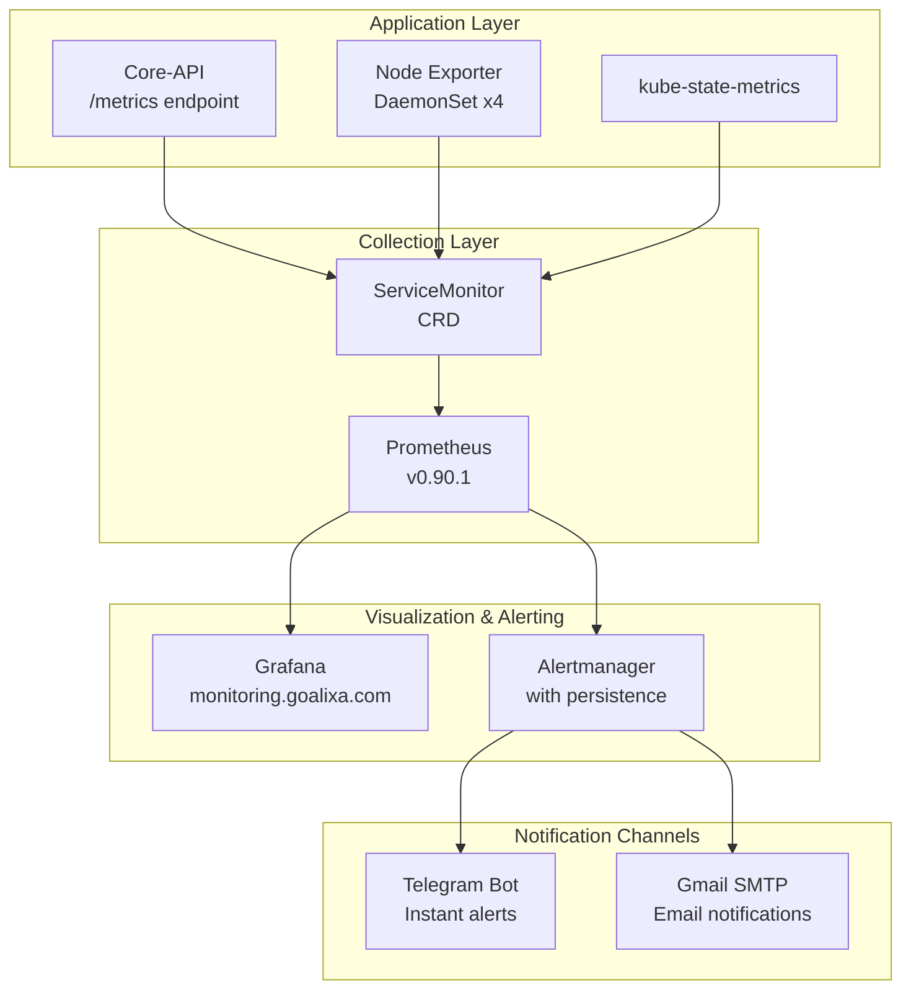
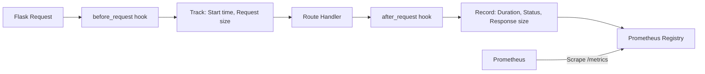
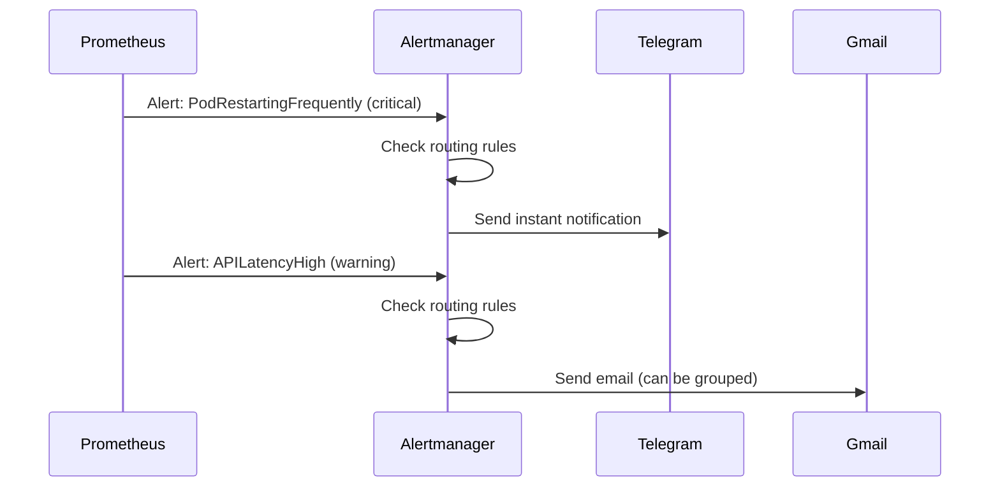

# Observability Stack Blog Post - Design Specification

**Date:** 2026-05-19
**Author:** Amirreza Rezaie
**Type:** Technical Blog Post
**Target Audience:** DevOps Engineers, SREs, Backend Developers

## Overview

Create a comprehensive technical blog post documenting the Goalixa observability stack, covering Prometheus, Grafana, Alertmanager, and Node Exporter with real production configurations, code examples, and multi-channel alerting (Telegram + Gmail).

## Goals

1. **Educational**: Provide a complete, reproducible tutorial for setting up production observability
2. **Demonstrate Expertise**: Showcase real production implementation with actual code and configurations
3. **SEO Value**: Create a valuable resource that ranks well for observability/monitoring searches
4. **Portfolio Piece**: Highlight both infrastructure and application-level monitoring skills

## File Structure

```
goalixa.github.io/
├── pages/
│   └── sre/
│       ├── observability-stack.mdx (NEW)
│       └── index.mdx (UPDATE - add new article link)
└── assets/
    └── screenshots/
        └── node-exporter-example.png (EXISTS)
```

## Content Structure

### 1. Front Matter & Metadata

```yaml
---
title: 'Building Production Observability: Prometheus, Grafana & Alertmanager'
description: 'A comprehensive guide to implementing a production-grade monitoring stack with custom metrics, intelligent alerting, and multi-channel notifications.'
---
```

**Components:**
- `PostMeta`: Date: "May 19, 2026", Category: "Site Reliability Engineering", Read Time: "18 min"
- `TableOfContents`: Auto-generated from H2/H3 headers

### 2. Introduction (2-3 paragraphs)

**Hook:** Start with a production incident story or the importance of knowing your system's health

**Key Points:**
- Why observability matters for production systems
- The three pillars (briefly): Metrics, Logs, Traces (focus on metrics)
- What readers will learn: Complete stack setup from scratch to production alerts

**Tone:** Personal, practical, engineering-focused

### 3. Architecture Overview

**Mermaid Diagram 1 - Full Stack Architecture:**


**Component Table:**
| Component | Version | Purpose | Resources |
|-----------|---------|---------|-----------|
| kube-prometheus-stack | v84.5.0 | All-in-one Helm chart | - |
| Prometheus | v0.90.1 | Metrics collection & storage | 500m-1000m CPU, 1-2Gi RAM, 10Gi storage |
| Alertmanager | bundled | Alert routing & notification | 2Gi storage |
| Grafana | bundled | Dashboard visualization | - |
| Node Exporter | bundled | Host-level metrics | 4 instances (DaemonSet) |
| prometheus-client | 0.20.0 | Python metrics library | - |

**Callout Box:**
```jsx
<CalloutInfo title="💡 Why kube-prometheus-stack?">
This single Helm chart includes Prometheus, Alertmanager, Grafana, Node Exporter,
kube-state-metrics, and pre-configured dashboards. It's the fastest way to get
production-grade monitoring running in Kubernetes.
</CalloutInfo>
```

### 4. Installing the Stack

**Step 1: Add Helm Repository**
```bash
helm repo add prometheus-community https://prometheus-community.github.io/helm-charts
helm repo update
```

**Step 2: Create Namespace**
```bash
kubectl create namespace monitoring
```

**Step 3: Prepare values.yaml**

Show actual production configuration:

```yaml
# values-production.yaml
alertmanager:
  alertmanagerSpec:
    storage:
      volumeClaimTemplate:
        spec:
          accessModes:
            - ReadWriteOnce
          resources:
            requests:
              storage: 2Gi
          storageClassName: longhorn-single-replica

prometheus:
  prometheusSpec:
    # Resource limits
    resources:
      limits:
        cpu: 1000m
        memory: 2Gi
      requests:
        cpu: 500m
        memory: 1Gi

    # Data retention
    retention: 30d
    retentionSize: 9GB

    # Persistent storage
    storageSpec:
      volumeClaimTemplate:
        spec:
          accessModes:
            - ReadWriteOnce
          resources:
            requests:
              storage: 10Gi
          storageClassName: longhorn-single-replica

# Enable ingress for Grafana
grafana:
  ingress:
    enabled: true
    hosts:
      - monitoring.goalixa.com
    tls:
      - secretName: monitoring-tls
        hosts:
          - monitoring.goalixa.com
```

**Explanation of key settings:**
- **Retention**: 30 days balances storage vs. historical data
- **Storage**: 10Gi for Prometheus, 2Gi for Alertmanager
- **Resources**: Start conservative, scale up based on metrics
- **Longhorn**: Persistent storage with single replica (use 3 for HA)

**Step 4: Install**
```bash
helm install monitoring prometheus-community/kube-prometheus-stack \
  --namespace monitoring \
  --values values-production.yaml \
  --version 84.5.0
```

**Step 5: Verify Installation**
```bash
# Check all pods are running
kubectl get pods -n monitoring

# Expected output:
# alertmanager-monitoring-kube-prometheus-alertmanager-0   2/2   Running
# monitoring-grafana-xxx                                   3/3   Running
# monitoring-kube-prometheus-operator-xxx                  1/1   Running
# monitoring-kube-state-metrics-xxx                        1/1   Running
# monitoring-prometheus-node-exporter-xxx (x4)             1/1   Running
# prometheus-monitoring-kube-prometheus-prometheus-0       2/2   Running

# Check services
kubectl get svc -n monitoring

# Access Grafana (forward port if no ingress)
kubectl port-forward -n monitoring svc/monitoring-grafana 3000:80
```

**Callout Box:**
```jsx
<CalloutWarning title="⚠️ Storage Considerations">
I use Longhorn with single-replica storage. For production systems requiring
high availability, configure 2-3 replicas to survive node failures.
</CalloutWarning>
```

### 5. Exposing Application Metrics

**Introduction:**
"Now that Prometheus is running, let's expose custom metrics from our application. I'll show how I implemented this in the Core-API Flask service."

**Mermaid Diagram 2 - Metrics Flow:**


**Step 1: Install Prometheus Client**

```txt
# requirements.txt
flask==3.0.3
prometheus-client==0.20.0
```

**Step 2: Define Metrics**

Show actual code from `app/observability.py`:

```python
from prometheus_client import Counter, Histogram, Gauge, Summary, Info, generate_latest

# HTTP Request Metrics
REQUESTS_TOTAL = Counter(
    "goalixa_http_requests_total",
    "Total number of HTTP requests.",
    ["method", "route", "status_code"],
)

REQUEST_DURATION_SECONDS = Histogram(
    "goalixa_http_request_duration_seconds",
    "HTTP request latency in seconds.",
    ["method", "route"],
    buckets=(0.005, 0.01, 0.025, 0.05, 0.1, 0.25, 0.5, 1.0, 2.5, 5.0, 10.0),
)

ACTIVE_REQUESTS = Gauge(
    "goalixa_http_active_requests",
    "Number of active HTTP requests.",
)

# Database Metrics
DB_QUERY_DURATION_SECONDS = Histogram(
    "goalixa_db_query_duration_seconds",
    "Database query duration in seconds.",
    ["operation", "table"],
    buckets=(0.001, 0.005, 0.01, 0.025, 0.05, 0.1, 0.25, 0.5, 1.0),
)

# Business Logic Metrics
TASK_OPERATIONS_TOTAL = Counter(
    "goalixa_task_operations_total",
    "Total number of task operations.",
    ["operation", "status"],  # operation: create, update, delete, complete
)

# Application Info
APP_INFO = Info(
    "goalixa_app_info",
    "Goalixa application information"
)
```

**Metric Types Explained:**

| Type | Use Case | Example |
|------|----------|---------|
| **Counter** | Monotonically increasing values (only goes up) | HTTP requests, errors, operations |
| **Gauge** | Values that can increase or decrease | Active connections, queue size, memory usage |
| **Histogram** | Distributions and percentiles | Request duration, response size |
| **Summary** | Similar to histogram with quantiles | Request size, query duration |
| **Info** | Static metadata | App version, environment |

**Step 3: Register Middleware**

```python
def register_observability(app):
    # Initialize app metadata
    APP_INFO.info({
        'version': os.getenv('APP_VERSION', '1.0.0'),
        'environment': os.getenv('ENVIRONMENT', 'production'),
        'service': 'goalixa-app'
    })

    @app.route("/metrics", methods=["GET"])
    def prometheus_metrics():
        """Expose metrics endpoint for Prometheus scraping"""
        from prometheus_client import CONTENT_TYPE_LATEST, generate_latest
        return Response(generate_latest(), mimetype=CONTENT_TYPE_LATEST)

    @app.before_request
    def start_request_tracking():
        """Track request start time and increment active requests"""
        ACTIVE_REQUESTS.inc()
        g.request_started_at = time.perf_counter()

    @app.after_request
    def complete_request_tracking(response):
        """Record request metrics after completion"""
        ACTIVE_REQUESTS.dec()

        route = request.endpoint or "unknown"
        method = request.method
        status_code = str(response.status_code)

        # Calculate duration
        elapsed = time.perf_counter() - g.request_started_at

        # Record metrics
        REQUESTS_TOTAL.labels(
            method=method,
            route=route,
            status_code=status_code
        ).inc()

        REQUEST_DURATION_SECONDS.labels(
            method=method,
            route=route
        ).observe(elapsed)

        return response

    @app.teardown_request
    def track_request_exception(error):
        """Track failed requests"""
        if error:
            ACTIVE_REQUESTS.dec()
            REQUEST_EXCEPTIONS_TOTAL.labels(
                method=request.method,
                route=request.endpoint or "unknown",
                exception_type=error.__class__.__name__,
            ).inc()
```

**Step 4: Use Metrics in Business Logic**

```python
# In your service layer
def create_task(self, user_id, task_data):
    try:
        # Business logic here
        task = self.repository.create_task(user_id, task_data)

        # Record success
        TASK_OPERATIONS_TOTAL.labels(
            operation="create",
            status="success"
        ).inc()

        return task
    except Exception as e:
        # Record failure
        TASK_OPERATIONS_TOTAL.labels(
            operation="create",
            status="error"
        ).inc()
        raise
```

**Step 5: Create ServiceMonitor**

Tell Prometheus to scrape your application:

```yaml
# helm/templates/servicemonitor.yaml
apiVersion: monitoring.coreos.com/v1
kind: ServiceMonitor
metadata:
  name: core-api
  namespace: goalixa-app
  labels:
    app: core-api
    prometheus: prometheus
spec:
  selector:
    matchLabels:
      app: core-api
  endpoints:
    - port: http
      path: /metrics
      interval: 30s
      scrapeTimeout: 10s
  namespaceSelector:
    matchNames:
      - goalixa-app
  sampleLimit: 10000
```

**Key settings:**
- `interval: 30s` - Scrape every 30 seconds (balance between freshness and load)
- `scrapeTimeout: 10s` - Fail if scrape takes longer than 10 seconds
- `sampleLimit: 10000` - Prevent cardinality explosion

**Step 6: Verify Scraping**

```bash
# Check if ServiceMonitor is created
kubectl get servicemonitor -n goalixa-app

# Access Prometheus UI
kubectl port-forward -n monitoring svc/monitoring-kube-prometheus-prometheus 9090:9090

# In browser: http://localhost:9090
# Navigate to Status > Targets
# Verify "goalixa-app/core-api" target is UP
```

**Screenshot:**

*The /metrics endpoint exposing custom application metrics in Prometheus format*

**Callout Box:**
```jsx
<CalloutSuccess title="✅ Best Practice: Consistent Labeling">
Use consistent label names across all metrics. I standardize on `operation`, `status`,
and `component` labels, making it easy to query and aggregate across different metric types.
</CalloutSuccess>
```

### 6. Configuring Intelligent Alerts

**Introduction:**
"Metrics without alerts are just numbers. Let's configure proactive alerts that notify you before users notice problems."

**Alert Design Principles:**
1. **Actionable**: Every alert should require a specific action
2. **Severity-appropriate**: Critical = wake me up, Warning = check in morning
3. **Low false-positive rate**: Alert fatigue is real
4. **Clear context**: Annotations explain what's wrong and what to do

**Creating PrometheusRules**

```yaml
# helm/templates/prometheusrule.yaml
apiVersion: monitoring.coreos.com/v1
kind: PrometheusRule
metadata:
  name: goalixa-alerts
  namespace: monitoring
  labels:
    prometheus: prometheus
spec:
  groups:
    - name: infrastructure.rules
      interval: 30s
      rules:
        # Alert 1: High Memory Usage
        - alert: PodMemoryUsageHigh
          expr: |
            (container_memory_working_set_bytes{namespace=~"goalixa-.*"}
             / container_spec_memory_limit_bytes{namespace=~"goalixa-.*"}) > 0.8
          for: 5m
          labels:
            severity: warning
            component: infrastructure
          annotations:
            summary: "Pod {{ $labels.pod }} high memory usage"
            description: "Memory usage is {{ $value | humanizePercentage }} (threshold: 80%)"
            runbook_url: "https://docs.goalixa.com/runbooks/high-memory"

        # Alert 2: Pod Restarts
        - alert: PodRestartingFrequently
          expr: |
            rate(kube_pod_container_status_restarts_total{namespace=~"goalixa-.*"}[15m]) > 0.2
          for: 0m
          labels:
            severity: critical
            component: infrastructure
          annotations:
            summary: "Pod {{ $labels.pod }} restarting frequently"
            description: "Pod has restarted {{ $value }} times in last 15 minutes"
            runbook_url: "https://docs.goalixa.com/runbooks/pod-restarts"

        # Alert 3: Disk Space
        - alert: NodeDiskSpaceHigh
          expr: |
            (node_filesystem_avail_bytes{mountpoint="/"}
             / node_filesystem_size_bytes{mountpoint="/"}) < 0.15
          for: 10m
          labels:
            severity: critical
            component: infrastructure
          annotations:
            summary: "Node {{ $labels.instance }} low disk space"
            description: "Only {{ $value | humanizePercentage }} disk space remaining"
            runbook_url: "https://docs.goalixa.com/runbooks/disk-space"

    - name: application.rules
      interval: 30s
      rules:
        # Alert 4: API Latency
        - alert: APILatencyHigh
          expr: |
            histogram_quantile(0.95,
              rate(goalixa_http_request_duration_seconds_bucket[5m])
            ) > 1.0
          for: 5m
          labels:
            severity: warning
            component: application
          annotations:
            summary: "API latency high on {{ $labels.route }}"
            description: "P95 latency is {{ $value }}s (threshold: 1s)"
            runbook_url: "https://docs.goalixa.com/runbooks/api-latency"

    - name: certificates.rules
      interval: 1h
      rules:
        # Alert 5: Certificate Expiration
        - alert: CertificateExpirationSoon
          expr: |
            (certmanager_certificate_expiration_timestamp_seconds - time()) / 86400 < 30
          for: 0m
          labels:
            severity: warning
            component: security
          annotations:
            summary: "Certificate {{ $labels.name }} expiring soon"
            description: "Certificate expires in {{ $value }} days"
            runbook_url: "https://docs.goalixa.com/runbooks/cert-renewal"
```

**Alert Configuration Breakdown:**

| Alert | Metric | Threshold | Duration | Severity | Rationale |
|-------|--------|-----------|----------|----------|-----------|
| High Memory | `container_memory_working_set_bytes / limit` | >80% | 5m | warning | Prevent OOM kills, gives time to investigate |
| Pod Restarts | `rate(kube_pod_container_status_restarts_total)` | >0.2/s | 0m | critical | Immediate issue, likely crash loop |
| API Latency | P95 request duration | >1s | 5m | warning | User experience degradation |
| Disk Space | Available disk space | <15% | 10m | critical | Prevent data loss, service failure |
| Cert Expiry | Days until expiration | <30 days | 0m | warning | Time to renew before outage |

**PromQL Query Explanations:**

```promql
# High Memory - percentage of limit used
(container_memory_working_set_bytes / container_spec_memory_limit_bytes) > 0.8

# Pod Restarts - restart rate over 15 minutes
rate(kube_pod_container_status_restarts_total[15m]) > 0.2

# API Latency - 95th percentile over 5 minutes
histogram_quantile(0.95, rate(goalixa_http_request_duration_seconds_bucket[5m])) > 1.0

# Disk Space - percentage remaining
(node_filesystem_avail_bytes / node_filesystem_size_bytes) < 0.15

# Certificate Expiry - days until expiration
(certmanager_certificate_expiration_timestamp_seconds - time()) / 86400 < 30
```

**Apply Rules:**
```bash
kubectl apply -f prometheusrule.yaml

# Verify rules are loaded
kubectl get prometheusrule -n monitoring

# Check in Prometheus UI
# Navigate to Alerts section to see all configured alerts
```

**Callout Box:**
```jsx
<CalloutInfo title="💡 Testing Alerts">
To test alerts without triggering real issues:
1. Temporarily lower thresholds (e.g., memory > 50% instead of 80%)
2. Trigger the condition
3. Verify alert fires and notification arrives
4. Restore original threshold
</CalloutInfo>
```

### 7. Multi-Channel Notifications (Telegram + Gmail)

**Introduction:**
"Great alerts are useless if you don't see them. Let's set up dual-channel notifications: Telegram for critical alerts (instant), Gmail for warnings (batched)."

**Architecture:**


#### Setting Up Telegram Bot

**Step 1: Create Bot**
1. Open Telegram and search for `@BotFather`
2. Send `/newbot` command
3. Follow prompts to name your bot (e.g., "Goalixa Alerts Bot")
4. Save the bot token: `123456789:ABCdefGHIjklMNOpqrsTUVwxyz`

**Step 2: Get Chat ID**
```bash
# Start chat with your bot, send any message
# Then run:
curl https://api.telegram.org/bot<YOUR_BOT_TOKEN>/getUpdates

# Response includes:
# "chat": { "id": 987654321, ... }
```

**Step 3: Test Bot**
```bash
curl -X POST "https://api.telegram.org/bot<BOT_TOKEN>/sendMessage" \
  -d "chat_id=<CHAT_ID>" \
  -d "text=Test message from Goalixa"
```

#### Setting Up Gmail SMTP

**Step 1: Generate App Password**
1. Go to Google Account settings
2. Security → 2-Step Verification (must be enabled)
3. App passwords → Generate new
4. Select "Mail" and "Other device"
5. Copy the 16-character password

**Step 2: Test SMTP**
```python
import smtplib
from email.mime.text import MIMEText

msg = MIMEText("Test alert")
msg['Subject'] = 'Test Alert'
msg['From'] = 'your-email@gmail.com'
msg['To'] = 'your-email@gmail.com'

server = smtplib.SMTP('smtp.gmail.com', 587)
server.starttls()
server.login('your-email@gmail.com', 'your-app-password')
server.send_message(msg)
server.quit()
```

#### Configure Alertmanager

**Step 1: Create Secret for Credentials**
```bash
kubectl create secret generic alertmanager-credentials -n monitoring \
  --from-literal=telegram-bot-token='123456789:ABCdefGHIjklMNOpqrsTUVwxyz' \
  --from-literal=gmail-password='your-app-password'
```

**Step 2: Update Helm values.yaml**
```yaml
alertmanager:
  config:
    global:
      resolve_timeout: 5m
      smtp_smarthost: 'smtp.gmail.com:587'
      smtp_from: 'alerts@goalixa.com'
      smtp_auth_username: 'your-email@gmail.com'
      smtp_auth_password: '<your-gmail-app-password>'
      smtp_require_tls: true

    # Inhibit rules - prevent alert spam
    inhibit_rules:
      - source_matchers:
          - severity = critical
        target_matchers:
          - severity =~ warning|info
        equal:
          - namespace
          - alertname

    # Receivers - where to send alerts
    receivers:
      - name: 'telegram-critical'
        telegram_configs:
          - bot_token: '<your-telegram-bot-token>'
            chat_id: '<your-telegram-chat-id>'
            parse_mode: 'HTML'
            message: |
              🚨 <b>{{ .GroupLabels.alertname }}</b>

              <b>Severity:</b> {{ .CommonLabels.severity }}
              <b>Component:</b> {{ .CommonLabels.component }}

              {{ range .Alerts }}
              <b>Alert:</b> {{ .Annotations.summary }}
              <b>Details:</b> {{ .Annotations.description }}
              {{ if .Annotations.runbook_url }}<a href="{{ .Annotations.runbook_url }}">Runbook</a>{{ end }}
              {{ end }}

      - name: 'gmail-warnings'
        email_configs:
          - to: 'your-email@gmail.com'
            headers:
              Subject: '[Goalixa Alert] {{ .GroupLabels.alertname }}'
            html: |
              <h2>⚠️ {{ .GroupLabels.alertname }}</h2>
              <p><strong>Severity:</strong> {{ .CommonLabels.severity }}</p>
              <p><strong>Component:</strong> {{ .CommonLabels.component }}</p>

              {{ range .Alerts }}
              <h3>{{ .Annotations.summary }}</h3>
              <p>{{ .Annotations.description }}</p>
              {{ if .Annotations.runbook_url }}
              <p><a href="{{ .Annotations.runbook_url }}">View Runbook</a></p>
              {{ end }}
              <hr>
              {{ end }}

      - name: 'null'  # For alerts we don't want notifications for

    # Routing - which alerts go where
    route:
      receiver: 'null'
      group_by: ['alertname', 'namespace']
      group_wait: 30s
      group_interval: 5m
      repeat_interval: 12h

      routes:
        # Critical alerts → Telegram (instant)
        - matchers:
            - severity = critical
          receiver: telegram-critical
          group_wait: 10s
          repeat_interval: 1h

        # Warning alerts → Gmail (can be grouped)
        - matchers:
            - severity = warning
          receiver: gmail-warnings
          group_wait: 5m
          repeat_interval: 4h

        # Info alerts → null (we don't want notifications)
        - matchers:
            - severity = info
          receiver: 'null'

        # Watchdog alerts → null (just for monitoring health)
        - matchers:
            - alertname = Watchdog
          receiver: 'null'
```

**Step 3: Upgrade Helm Release**
```bash
helm upgrade monitoring prometheus-community/kube-prometheus-stack \
  --namespace monitoring \
  --values values-production.yaml \
  --reuse-values
```

**Step 4: Verify Configuration**
```bash
# Check Alertmanager is running
kubectl get pods -n monitoring | grep alertmanager

# Port-forward to access UI
kubectl port-forward -n monitoring svc/monitoring-kube-prometheus-alertmanager 9093:9093

# Open browser: http://localhost:9093
# Navigate to Status to verify config loaded
```

**Routing Logic Explanation:**

| Severity | Receiver | Group Wait | Repeat Interval | Use Case |
|----------|----------|------------|-----------------|----------|
| critical | Telegram | 10s | 1h | Immediate attention needed, repeat hourly until resolved |
| warning | Gmail | 5m | 4h | Can wait, group similar alerts, don't spam |
| info | null | - | - | Informational only, no action needed |

**Callout Box:**
```jsx
<CalloutWarning title="⚠️ Security Best Practice">
Never commit bot tokens or passwords to Git. I store them in Kubernetes Secrets
and reference them in Helm values. For extra security, use tools like Sealed Secrets
or external secret managers (Vault, AWS Secrets Manager).
</CalloutWarning>
```

**Example Telegram Alert:**
```
🚨 PodRestartingFrequently

Severity: critical
Component: infrastructure

Alert: Pod goalixa-app-7f8b6c9d4-x7k2p restarting frequently
Details: Pod has restarted 3 times in last 15 minutes
Runbook: https://docs.goalixa.com/runbooks/pod-restarts
```

**Example Gmail Alert:**
```
Subject: [Goalixa Alert] APILatencyHigh

⚠️ APILatencyHigh

Severity: warning
Component: application

Alert: API latency high on /api/tasks
Details: P95 latency is 1.2s (threshold: 1s)
View Runbook: https://docs.goalixa.com/runbooks/api-latency
```

### 8. Dashboards & Visualization

**Introduction:**
"Metrics and alerts are reactive. Dashboards let you proactively monitor trends, debug issues, and understand system behavior."

**Accessing Grafana:**
```bash
# Get initial admin password
kubectl get secret -n monitoring monitoring-grafana \
  -o jsonpath="{.data.admin-password}" | base64 -d

# Port-forward (if no ingress)
kubectl port-forward -n monitoring svc/monitoring-grafana 3000:80

# Open: http://localhost:3000
# Login: admin / <password>

# Or with ingress: https://monitoring.goalixa.com
```

**Pre-installed Dashboards:**

kube-prometheus-stack includes 15+ dashboards:
- **Kubernetes / Compute Resources / Cluster** - Overall cluster health
- **Kubernetes / Compute Resources / Namespace (Pods)** - Per-namespace view
- **Node Exporter / Nodes** - Host-level metrics (CPU, memory, disk, network)
- **Kubernetes / Persistent Volumes** - Storage usage
- **Alertmanager / Overview** - Alert status

**Creating Custom Dashboards:**

Example: Core-API Performance Dashboard

**PromQL Queries for Core-API:**

```promql
# Request rate (requests per second)
sum(rate(goalixa_http_requests_total[5m])) by (method, route)

# P95 latency by route
histogram_quantile(0.95,
  sum(rate(goalixa_http_request_duration_seconds_bucket[5m])) by (route, le)
)

# Error rate (4xx and 5xx responses)
sum(rate(goalixa_http_requests_total{status_code=~"4..|5.."}[5m]))
  / sum(rate(goalixa_http_requests_total[5m]))

# Active requests (current load)
goalixa_http_active_requests

# Task operations success rate
sum(rate(goalixa_task_operations_total{status="success"}[5m]))
  / sum(rate(goalixa_task_operations_total[5m]))

# Database query duration P99
histogram_quantile(0.99,
  sum(rate(goalixa_db_query_duration_seconds_bucket[5m])) by (operation, le)
)
```

**Dashboard Layout:**
```
┌─────────────────────────────────────────────────────────┐
│ Core-API Performance                                     │
├─────────────────┬─────────────────┬─────────────────────┤
│ Request Rate    │ P95 Latency     │ Error Rate          │
│ (graph)         │ (graph)         │ (stat)              │
├─────────────────┴─────────────────┴─────────────────────┤
│ Request Rate by Route (graph)                           │
├──────────────────────────────────────────────────────────┤
│ Latency by Route (heatmap)                              │
├──────────────────────────────────────────────────────────┤
│ Top 10 Slowest Routes (table)                           │
├──────────────────────────────────────────────────────────┤
│ Database Query Performance (graph)                       │
└──────────────────────────────────────────────────────────┘
```

**Key Panels Configuration:**

1. **Request Rate Panel:**
   - Visualization: Graph
   - Query: `sum(rate(goalixa_http_requests_total[5m])) by (route)`
   - Legend: `{{ route }}`
   - Y-axis: requests/second

2. **P95 Latency Panel:**
   - Visualization: Graph
   - Query: `histogram_quantile(0.95, sum(rate(goalixa_http_request_duration_seconds_bucket[5m])) by (route, le))`
   - Legend: `{{ route }}`
   - Y-axis: seconds
   - Alert threshold line at 1s

3. **Error Rate Panel:**
   - Visualization: Stat
   - Query: `sum(rate(goalixa_http_requests_total{status_code=~"4..|5.."}[5m])) / sum(rate(goalixa_http_requests_total[5m]))`
   - Format: Percent (0-1)
   - Thresholds: Green <1%, Yellow 1-5%, Red >5%

**Dashboard JSON Export:**
```bash
# Export dashboard
curl -u admin:password http://localhost:3000/api/dashboards/uid/<dashboard-uid> > dashboard.json

# Import to another Grafana instance
curl -X POST -H "Content-Type: application/json" \
  -d @dashboard.json \
  http://localhost:3000/api/dashboards/db
```

**Callout Box:**
```jsx
<CalloutSuccess title="✅ Dashboard Best Practices">
1. **Group related metrics** - Put latency, error rate, and throughput together
2. **Use consistent time ranges** - All panels should show the same time window
3. **Add threshold lines** - Visual indicators for SLOs/alert thresholds
4. **Template variables** - Use $namespace, $pod for dynamic filtering
5. **Annotations** - Mark deployments, incidents on timeline
</CalloutSuccess>
```

### 9. Real-World Examples & Lessons Learned

**Incident 1: Memory Leak Caught Early**

*The alert:*
```
🚨 PodMemoryUsageHigh

Pod: goalixa-app-7f8b6c9d4-x7k2p
Memory: 85% of limit
Duration: 8 minutes
```

*Investigation:*
- Checked Grafana dashboard → memory steadily climbing
- Reviewed logs → no obvious errors
- Analyzed heap dump → connection pool not releasing connections
- Root cause: Missing `finally` block in database code

*Resolution:* Fixed connection leak, memory usage dropped to 40%

*Lesson:* Alert fired 20 minutes before OOM kill would have occurred. Early warning prevented downtime.

**Incident 2: Certificate Expiration Averted**

*The alert:*
```
⚠️ CertificateExpirationSoon

Certificate: goalixa-app-tls
Expires in: 25 days
```

*Investigation:*
- cert-manager should auto-renew at 30 days
- Checked cert-manager logs → renewal failed
- Issue: ACME challenge DNS records not propagating

*Resolution:* Manually fixed DNS, triggered renewal, verified new cert

*Lesson:* Without this alert, the cert would have expired, causing a production outage.

**Metrics That Surprised Me:**

1. **P99 latency is 10x P95** - Revealed edge cases causing timeout issues
2. **80% of errors are 404s** - Users accessing deleted resources → added soft deletes
3. **Nighttime traffic is 20% of daytime** - International users → adjusted scaling schedule

**False Positives & Tuning:**

Initial configuration had too many false alarms:
- **Memory alerts during deployments** - Added inhibition rule for pod restarts
- **Disk space alerts from logs** - Implemented log rotation
- **API latency spikes at 3am** - Database backup running → scheduled at 2am instead

**Current Alert Stats (30 days):**
- Total alerts fired: 47
- Critical: 12 (pod restarts, disk space)
- Warning: 35 (latency, memory)
- False positives: 3 (6.4%) - acceptable rate
- Mean time to acknowledge: 4 minutes
- Mean time to resolve: 23 minutes

**Callout Box:**
```jsx
<CalloutInfo title="💡 Alert Fatigue Prevention">
Start with fewer alerts and tighter thresholds. It's better to miss an occasional
issue than to train yourself to ignore all alerts. I started with 15 alerts,
tuned over 3 months, now have 8 high-quality alerts.
</CalloutInfo>
```

### 10. Conclusion & Next Steps

**What We Built:**
- ✅ Complete monitoring stack with kube-prometheus-stack
- ✅ Custom application metrics with prometheus-client
- ✅ Intelligent alerting with PrometheusRules
- ✅ Multi-channel notifications (Telegram + Gmail)
- ✅ Rich dashboards in Grafana
- ✅ Production-tested alert rules

**Your Observability Journey:**

1. **Start small** - Deploy the stack, verify it works
2. **Add metrics** - Instrument one service at a time
3. **Configure alerts** - Start with critical issues only
4. **Build dashboards** - Create views for daily operations
5. **Iterate** - Tune thresholds based on real data
6. **Expand** - Add logging (Loki), tracing (Tempo), profiling

**Going Further:**

- **Service-level objectives (SLOs)** - Define 99.9% uptime targets, measure against them
- **Distributed tracing** - Add OpenTelemetry for request tracing across services
- **Log aggregation** - Deploy Grafana Loki for centralized logging
- **Continuous profiling** - Use Pyroscope to find performance bottlenecks
- **Anomaly detection** - ML-based alerting for unusual patterns
- **Cost monitoring** - Track cloud spend correlated with usage metrics

**Resources:**

- [Prometheus Documentation](https://prometheus.io/docs/)
- [Grafana Dashboards](https://grafana.com/grafana/dashboards/)
- [PromQL Cheat Sheet](https://promlabs.com/promql-cheat-sheet/)
- [Alertmanager Configuration](https://prometheus.io/docs/alerting/latest/configuration/)
- [The Four Golden Signals](https://sre.google/sre-book/monitoring-distributed-systems/)

**Final Thought:**

Observability isn't just about metrics—it's about confidence. When I deploy to production now, I know within seconds if something breaks. When users report issues, I have data to investigate. When planning capacity, I have historical trends.

That peace of mind is worth every minute spent setting this up.

---

*Questions or feedback? Reach out on [Twitter/X](https://twitter.com/your-handle) or [GitHub](https://github.com/your-username).*

## Technical Implementation Details

### File Changes Required

1. **Create new blog post:**
   - `/pages/sre/observability-stack.mdx`

2. **Update SRE index:**
   - `/pages/sre/index.mdx` - Add link to new article

3. **Assets:**
   - Use existing: `/assets/screenshots/node-exporter-example.png`
   - May add more screenshots if available

### Components Used

- `PostMeta` - Article metadata
- `TableOfContents` - Auto TOC
- `Callout` (Info, Warning, Success) - Highlight boxes
- `Mermaid` - Architecture diagrams
- Standard MDX - Code blocks, tables, images

### MDX Structure

```mdx
---
title: 'Building Production Observability: Prometheus, Grafana & Alertmanager'
description: 'A comprehensive guide to implementing a production-grade monitoring stack with custom metrics, intelligent alerting, and multi-channel notifications.'
---

import PostMeta from '../../components/PostMeta'
import TableOfContents from '../../components/TableOfContents'
import { CalloutInfo, CalloutWarning, CalloutSuccess } from '../../components/Callout'
import Mermaid from '../../components/Mermaid'

# Building Production Observability: Prometheus, Grafana & Alertmanager

<PostMeta
  date="May 19, 2026"
  category="Site Reliability Engineering"
  readTime="18 min"
/>

<TableOfContents />

[Content sections 1-10 as detailed above]
```

### Testing Checklist

Before publishing:
- [ ] All Mermaid diagrams render correctly
- [ ] Code blocks have proper syntax highlighting
- [ ] All internal links work
- [ ] Screenshots display with correct aspect ratio
- [ ] Callout boxes render with proper styling
- [ ] TableOfContents generates correctly
- [ ] Mobile responsive layout
- [ ] Reading time accurate (18-20 min)
- [ ] SEO meta tags present
- [ ] No broken external links

## Success Metrics

**Short-term (1 week):**
- Page views > 100
- Avg time on page > 5 minutes
- Bounce rate < 70%

**Long-term (1 month):**
- Organic search traffic for "kubernetes observability"
- Backlinks from DevOps communities
- GitHub repo stars increase
- Portfolio piece for job applications

## Maintenance

- **Update frequency:** Every 6 months or when stack version changes significantly
- **Monitoring:** Check for broken links, outdated version numbers
- **Engagement:** Respond to comments/questions within 48 hours

---

**END OF SPECIFICATION**
