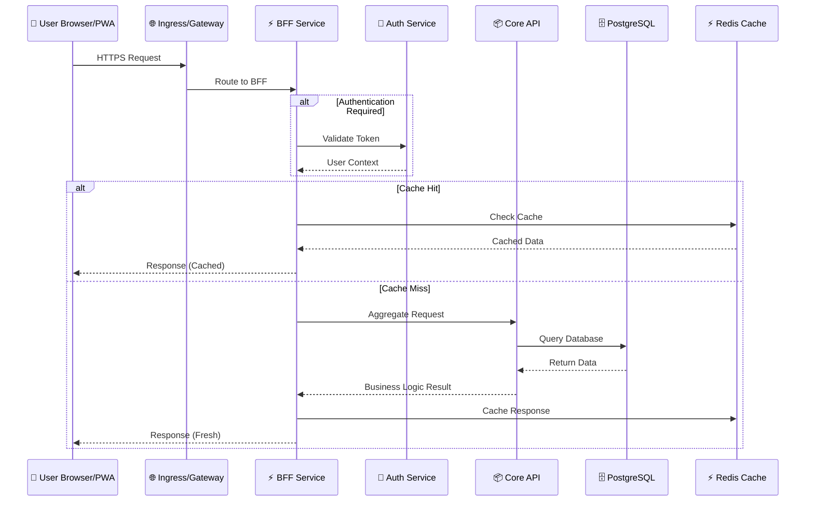
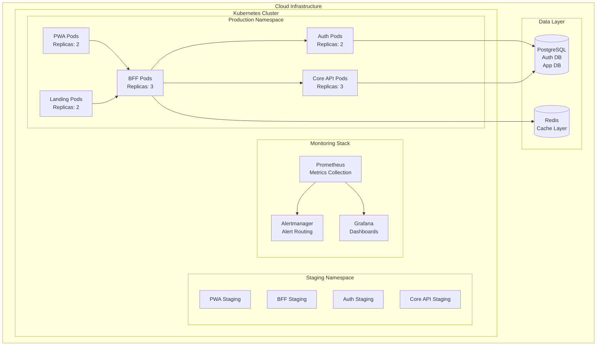
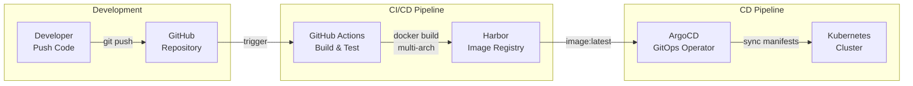
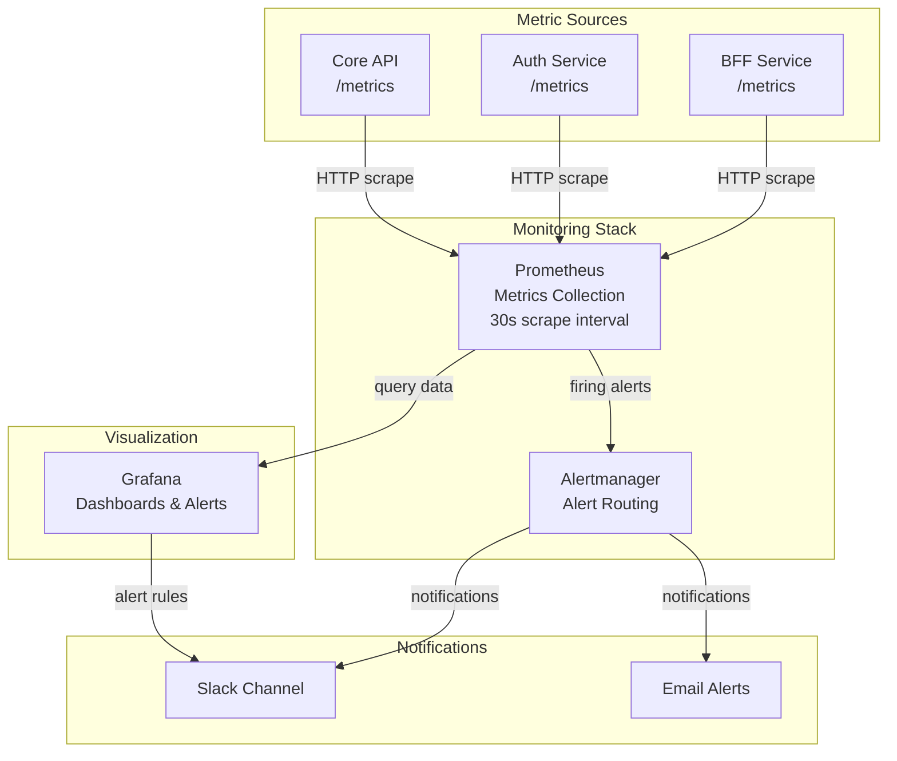

import ArchitecturePage from '../components/ArchitecturePage'

<ArchitecturePage>

## User Request Journey

When a user interacts with Goalixa, requests flow through a carefully orchestrated chain of microservices:

### Request Flow Breakdown

1. **User Action** — User interacts with the PWA or web interface
2. **Ingress** — Nginx Ingress routes HTTPS traffic to the appropriate service
3. **BFF** — Backend for Frontend acts as the API gateway, handling authentication proxy and request aggregation
4. **Auth Service** — Validates JWT tokens and provides user context
5. **Core API** — Processes business logic and data operations
6. **Data Layer** — PostgreSQL for persistent storage, Redis for caching
7. **Response** — Data flows back through BFF to the user with optimal caching

## Services Overview

Goalixa consists of specialized microservices, each with a single responsibility:

| Service | Technology | Purpose | Database | Key Features |
|---------|-----------|---------|----------|--------------|
| **Landing** | Nginx + HTML/CSS/JS | Marketing website | None | Static content, responsive design, SEO optimized |
| **PWA** | Vanilla JavaScript | Progressive Web App | None | Installable, offline support, client-side routing |
| **Auth** | Python 3.11 + Flask | Authentication service | PostgreSQL | Dual-token JWT, Google OAuth, HTTP-only cookies |
| **BFF** | Python 3.11 + FastAPI | Backend for Frontend | Redis (optional) | API gateway, auth proxy, response aggregation |
| **Core API** | Python 3.11 + Flask | Main business logic | PostgreSQL | Tasks, goals, projects, habits, reports |
| **Syntra** | Python 3.11 + FastAPI + CrewAI | AI DevOps orchestration | None | Task planning, DevOps automation, code review |

### Service Details

#### Auth (Authentication Service)
- **Dual-Token System**: Access tokens (15-minute TTL) + Refresh tokens (7-day TTL)
- **Security**: HTTP-only cookies, token rotation on refresh
- **OAuth**: Google OAuth integration for social login
- **Database**: Dedicated PostgreSQL database (`authdb`)

#### Core API (Main Business Logic)
- **3-Layer Architecture**: Presentation → Service → Repository
- **Features**: Task timer, goal tracking, project management, habits, reports
- **Database**: Dedicated PostgreSQL database (`goalixa`)
- **Backup**: Automated database backups

#### BFF (Backend for Frontend)
- **API Gateway**: Unified entry point (`/bff/*`)
- **Aggregation**: Optimized endpoints like `/bff/aggregate/dashboard`
- **Caching**: Redis-based performance optimization
- **Auth Proxy**: Automatic token validation and refresh

#### Syntra (AI DevOps Service)
- **Multi-Agent System**: CrewAI-powered task orchestration
- **Capabilities**: Kubernetes operations, code review, incident investigation
- **Planning**: AI-driven task breakdown and execution

## Infrastructure

Goalixa runs on a cloud-native infrastructure designed for high availability and scalability:

### Infrastructure Components

- **Kubernetes Cluster**: Container orchestration with namespace separation (staging/production)
- **Pods**: Each service runs multiple replicas for high availability
- **Services**: Kubernetes Services provide stable networking endpoints
- **Ingress**: Nginx Ingress Controller for HTTPS routing
- **Data Layer**: PostgreSQL for persistence, Redis for caching

## Data Storage

Goalixa uses a multi-database architecture optimized for different data types:

| Database | Purpose | Technology | Connection |
|----------|---------|------------|------------|
| **authdb** | User accounts, sessions, OAuth tokens | PostgreSQL 16 | Auth Service |
| **goalixa** | Tasks, goals, projects, habits, time entries | PostgreSQL 16 | Core API |
| **Redis** | Response caching, session storage | Redis 7+ | BFF (optional) |

## CI/CD Pipeline

Goalixa uses a modern GitOps-based CI/CD pipeline for automated deployments:

### Pipeline Stages

#### 1. Continuous Integration (GitHub Actions)
- **Trigger**: Push to `staging` or `main` branch
- **Build**: Multi-architecture Docker builds (amd64/arm64)
- **Test**: Run unit tests and integration tests
- **Push**: Deploy images to Harbor registry

#### 2. Container Registry (Harbor)
- **Private Registry**: Harbor container registry
- **Image Tagging**: `{service}/{service}:latest`
- **Multi-Arch**: Support for different CPU architectures
- **Vulnerability Scanning**: Automated security scans

#### 3. Continuous Deployment (ArgoCD)
- **GitOps**: Configuration stored in Git repository
- **Automatic Sync**: Detects image changes and auto-deploys
- **Helm Integration**: Parameter-based deployments
- **Environments**: Separate applications for staging/production

## Monitoring & Observability

Goalixa implements comprehensive monitoring across the entire stack:

### Monitoring Components

#### 1. Prometheus (Metrics Collection)
- **Scrape Interval**: Every 30 seconds
- **Targets**: BFF Service, Auth Service, Core API, Node Exporters

#### 2. Grafana (Visualization & Dashboards)
- **Custom Dashboards**: Service-specific dashboards
- **Metrics**: Request rate, latency, error rates, resource utilization

#### 3. Alertmanager (Alert Routing)
- **Alert Sources**: Prometheus alert rules
- **Routing**: Intelligent alert grouping and routing
- **Channels**: Slack, Email (configurable)

## Architecture Principles

Goalixa's architecture is built on these core principles:

### 1. Microservices
- Single responsibility per service
- Independent deployment and scaling
- Clear service boundaries

### 2. Backend for Frontend (BFF)
- Optimized API for frontend needs
- Request aggregation reduces round trips
- Authentication proxy simplifies frontend

### 3. GitOps
- Infrastructure as code
- Declarative configuration
- Automated deployment

### 4. Observability First
- Comprehensive metrics collection
- Structured logging
- Proactive alerting

### 5. Security by Design
- Dual-token authentication
- HTTP-only cookies
- Short-lived access tokens
- Secrets management

## Technology Stack Summary

| Layer | Technology | Purpose |
|-------|-----------|---------|
| **Frontend** | Vanilla JavaScript, PWA | Installable offline-capable app |
| **API Gateway** | Nginx, FastAPI (BFF) | Request routing, aggregation |
| **Services** | Python 3.11, Flask/FastAPI | Business logic |
| **Data** | PostgreSQL 16, Redis 7+ | Persistent storage, caching |
| **Containers** | Docker, Kubernetes | Containerization, orchestration |
| **CI/CD** | GitHub Actions, Harbor, ArgoCD | Build, registry, deployment |
| **Monitoring** | Prometheus, Grafana, Alertmanager | Metrics, visualization, alerting |
| **AI** | CrewAI, LangChain | AI-powered DevOps automation |

---

*Built with ❤️ using modern cloud-native practices*

</ArchitecturePage>
