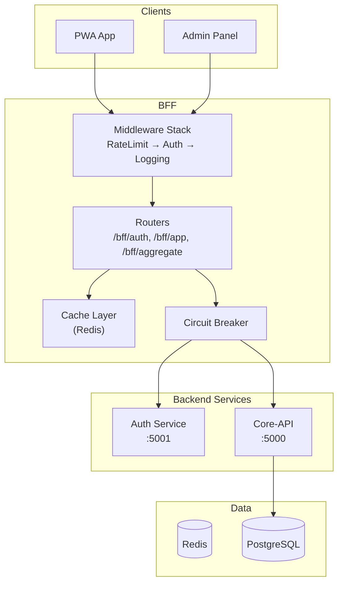
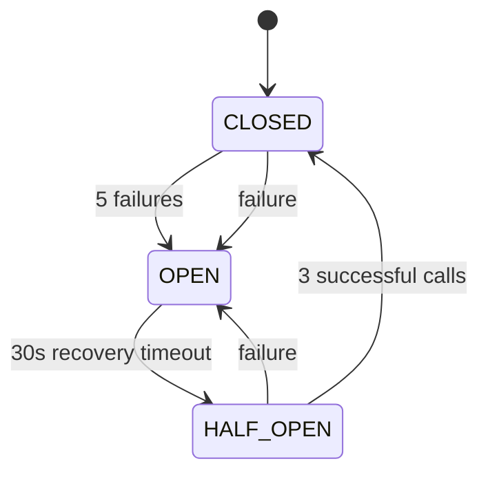

# BFF Service

The **BFF (Backend for Frontend)** service acts as an API Gateway, providing a unified API layer with authentication proxy, request aggregation, caching, and circuit breaker protection.

## Overview

Goalixa BFF is built with FastAPI and provides:
- Unified API entry point (`/bff/*`)
- Authentication proxy to Auth Service
- Request aggregation for optimized data fetching
- Redis-based caching
- Circuit breaker protection
- Prometheus metrics



## Technology Stack

| Component | Technology |
|-----------|------------|
| **Framework** | FastAPI (Python 3.11, async) |
| **HTTP Client** | httpx (async) |
| **Caching** | Redis |
| **Metrics** | Prometheus |
| **Authentication** | JWT validation |

## Project Structure

```
goalixa-BFF/
├── app/
│   ├── main.py              # Entry point
│   ├── config.py            # Configuration
│   ├── middleware/
│   │   ├── auth_middleware.py
│   │   ├── rate_limit_middleware.py
│   │   └── logging_middleware.py
│   ├── routers/
│   │   ├── health.py
│   │   ├── auth.py
│   │   ├── app_router.py
│   │   └── aggregate.py
│   ├── utils/
│   │   ├── cache.py
│   │   ├── circuit_breaker.py
│   │   └── metrics.py
├── k8s/
└── requirements.txt
```

## API Endpoints

### Health Checks

| Method | Endpoint | Description |
|--------|----------|-------------|
| GET | `/health` | Basic health check |
| GET | `/readiness` | Readiness probe |
| GET | `/liveness` | Liveness probe |
| GET | `/health/deep` | Deep health (checks backends) |
| GET | `/health/circuit-breaker/status` | Circuit breaker status |

### /bff/auth/* (Authentication Proxy)

| Method | Endpoint | Description |
|--------|----------|-------------|
| POST | `/bff/auth/login` | User login |
| POST | `/bff/auth/register` | User registration |
| POST | `/bff/auth/logout` | Logout |
| POST | `/bff/auth/refresh` | Refresh token |
| GET | `/bff/auth/me` | Get current user |
| POST | `/bff/auth/forgot` | Password reset request |
| POST | `/bff/auth/password-reset/confirm` | Confirm password reset |
| GET | `/bff/auth/sessions` | List active sessions |
| POST | `/bff/auth/sessions/revoke-all` | Revoke all sessions |

### /bff/app/* (App Service Proxy)

Proxies to Core-API with circuit breaker protection.

#### Tasks
| Method | Endpoint |
|--------|----------|
| GET | `/bff/app/tasks` |
| POST | `/bff/app/tasks` |
| POST | `/bff/app/tasks/{id}/edit` |
| POST | `/bff/app/tasks/{id}/start` |
| POST | `/bff/app/tasks/{id}/stop` |
| POST | `/bff/app/tasks/{id}/complete` |
| POST | `/bff/app/tasks/{id}/reopen` |
| POST | `/bff/app/tasks/{id}/delete` |
| POST | `/bff/app/tasks/bulk` |

#### Projects
| Method | Endpoint |
|--------|----------|
| GET | `/bff/app/projects` |
| POST | `/bff/app/projects` |
| POST | `/bff/app/projects/{id}/update` |
| POST | `/bff/app/projects/{id}/delete` |

#### Goals
| Method | Endpoint |
|--------|----------|
| GET | `/bff/app/goals` |
| POST | `/bff/app/goals` |
| POST | `/bff/app/goals/{id}/edit` |
| POST | `/bff/app/goals/{id}/delete` |
| POST | `/bff/app/goals/{id}/subgoals` |

#### Habits
| Method | Endpoint |
|--------|----------|
| GET | `/bff/app/habits` |
| POST | `/bff/app/habits` |
| POST | `/bff/app/habits/{id}/toggle` |
| POST | `/bff/app/habits/{id}/update` |
| POST | `/bff/app/habits/{id}/delete` |

#### Timer
| Method | Endpoint |
|--------|----------|
| GET | `/bff/app/timer` |
| GET | `/bff/app/timer/entries` |
| GET | `/bff/app/timer/dashboard` |

#### Reports
| Method | Endpoint |
|--------|----------|
| GET | `/bff/app/reports/summary` |

### /bff/aggregate/* (Aggregate Endpoints)

Optimized endpoints that fetch data from multiple services in parallel.

| Method | Endpoint | Description |
|--------|----------|-------------|
| GET | `/bff/aggregate/dashboard` | Complete dashboard data |
| GET | `/bff/aggregate/planner` | Planner view data |
| GET | `/bff/aggregate/reports` | Reports data |
| GET | `/bff/aggregate/overview` | User + tasks + summary |
| GET | `/bff/aggregate/timer-dashboard` | Timer dashboard |

## Authentication

The BFF performs dual JWT validation:

1. **Local Validation** (primary, faster):
   - Validates JWT using `jwt.decode()` with HS256
   - Only accepts `type: "access"` tokens
   - Checks token expiration

2. **Auth Service Validation** (fallback):
   - Calls auth service `/me` endpoint
   - Used when local validation fails

### Public Endpoints (no auth required)

```python
PUBLIC_ENDPOINTS = [
    "/", "/health", "/readiness", "/liveness", "/metrics", "/docs",
    "/bff/auth/login", "/bff/auth/register", "/bff/auth/forgot",
    "/bff/auth/password-reset/*", "/bff/auth/google", "/bff/auth/refresh"
]
```

## Caching

### Configuration

| Variable | Description | Default |
|----------|-------------|---------|
| `redis_enabled` | Enable Redis caching | `false` |
| `redis_url` | Redis connection URL | `redis://localhost:6379/0` |
| `cache_ttl_seconds` | Default cache TTL | `300` |

### TTL by Data Type

| Data Type | TTL (seconds) |
|-----------|---------------|
| User profile | 600 (10 min) |
| Tasks | 60 (1 min) |
| Projects | 300 (5 min) |
| Goals | 300 (5 min) |
| Labels | 600 (10 min) |
| Dashboard | 120 (2 min) |
| Aggregate | 180 (3 min) |

### Cache Operations

```python
# Get cached value
cached_data = await cache.get("tasks:user123")

# Set with TTL
await cache.set("tasks:user123", data, ttl=60)

# Invalidate user cache
await cache.invalidate_user_cache(user_id)

# Invalidate by pattern
await cache.delete_pattern("tasks:user123:*")
```

## Circuit Breaker

The BFF protects backend services with circuit breaker pattern:



### Configuration

| Parameter | Value |
|-----------|-------|
| Failure threshold | 5 |
| Recovery timeout | 30 seconds |
| Half-open max calls | 3 |

## Code Examples

### Aggregate Dashboard Request

```bash
curl -X GET http://localhost:8000/bff/aggregate/dashboard \
  -H "Authorization: Bearer <access_token>"
```

**Response:**
```json
{
  "status": "success",
  "data": {
    "tasks": [...],
    "projects": [...],
    "goals": [...],
    "habits": [...],
    "todos": [...],
    "user": {...}
  },
  "errors": {},
  "timestamp": "2026-04-06T10:00:00Z"
}
```

### Proxy Task Creation

```bash
curl -X POST http://localhost:8000/bff/app/tasks \
  -H "Content-Type: application/json" \
  -H "Authorization: Bearer <access_token>" \
  -d '{
    "title": "New task",
    "priority": "high",
    "project_id": 1
  }'
```

### Circuit Breaker Status

```bash
curl -X GET http://localhost:8000/health/circuit-breaker/status
```

**Response:**
```json
{
  "auth_service": {
    "state": "CLOSED",
    "failures": 0,
    "last_failure": null
  },
  "app_service": {
    "state": "CLOSED",
    "failures": 0,
    "last_failure": null
  }
}
```

## Configuration

### Environment Variables

| Variable | Description | Default |
|----------|-------------|---------|
| `AUTH_SERVICE_URL` | Auth service URL | `http://localhost:5001` |
| `APP_SERVICE_URL` | Core-API URL | `http://localhost:5000` |
| `AUTH_JWT_SECRET` | JWT validation secret | Required |
| `REDIS_URL` | Redis connection | `redis://localhost:6379/0` |
| `REDIS_ENABLED` | Enable Redis | `false` |
| `RATE_LIMIT` | Requests per minute | `100` |

### Docker

```bash
docker run -p 8000:8000 \
  -e AUTH_SERVICE_URL=http://auth-service:5001 \
  -e APP_SERVICE_URL=http://core-api:5000 \
  -e AUTH_JWT_SECRET=your-secret \
  -e REDIS_URL=redis://redis:6379/0 \
  -e REDIS_ENABLED=true \
  goalixa-bff:latest
```

### Kubernetes Deployment

```yaml
apiVersion: apps/v1
kind: Deployment
metadata:
  name: bff
spec:
  replicas: 3
  selector:
    matchLabels:
      app: bff
  template:
    metadata:
      labels:
        app: bff
    spec:
      containers:
      - name: bff
        image: goalixa/bff:latest
        ports:
        - containerPort: 8000
        env:
        - name: AUTH_SERVICE_URL
          value: http://auth-service:5001
        - name: APP_SERVICE_URL
          value: http://core-api:5000
        - name: AUTH_JWT_SECRET
          valueFrom:
            secretKeyRef:
              name: goalixa-secrets
              key: jwt-secret
        - name: REDIS_ENABLED
          value: "true"
        - name: REDIS_URL
          value: redis://redis:6379/0
        resources:
          requests:
            memory: "256Mi"
            cpu: "250m"
          limits:
            memory: "512Mi"
            cpu: "500m"
        livenessProbe:
          httpGet:
            path: /liveness
            port: 8000
        readinessProbe:
          httpGet:
            path: /readiness
            port: 8000
---
apiVersion: v1
kind: Service
metadata:
  name: bff
spec:
  selector:
    app: bff
  ports:
  - port: 80
    targetPort: 8000
```

## Metrics

| Metric | Type | Description |
|--------|------|-------------|
| `bff_requests_total` | Counter | Total requests |
| `bff_request_duration_seconds` | Histogram | Request duration |
| `bff_backend_requests_total` | Counter | Backend requests |
| `bff_backend_duration_seconds` | Histogram | Backend call duration |
| `bff_circuit_breaker_state` | Gauge | Circuit breaker state |
| `bff_cache_hits_total` | Counter | Cache hits |
| `bff_cache_misses_total` | Counter | Cache misses |
| `bff_rate_limited_total` | Counter | Rate limited requests |
