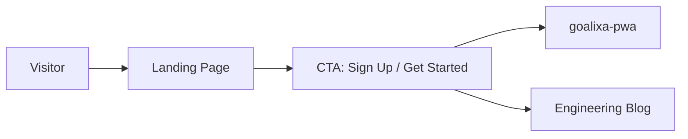

# Landing Page

The **Goalixa Landing** is a static marketing website for product presentation and user acquisition.

## Overview

A responsive, mobile-optimized static site built with vanilla HTML/CSS/JS:
- Product features showcase
- Clean, modern UI
- Call-to-action for signups
- No build process required



## Project Structure

```
goalixa-landing/
├── index.html          # Main page
├── style.css           # Styles
├── script.js           # Interactivity
├── assets/             # Images/icons
├── nginx.conf          # Nginx config
└── docker-compose.yml  # Docker setup
```

## Features

| Feature | Description |
|---------|-------------|
| Responsive Design | Mobile-first, works on all devices |
| Hero Section | Product tagline and CTA |
| Features Showcase | Key product features |
| Pricing | Pricing plans (if applicable) |
| Testimonials | User testimonials |
| FAQ | Frequently asked questions |
| Contact Form | Lead capture |

## Technology

| Component | Technology |
|-----------|------------|
| **HTML** | Semantic HTML5 |
| **CSS** | Custom CSS with CSS variables |
| **JS** | Vanilla JavaScript |
| **Server** | Nginx |
| **Deployment** | Docker |

## Deployment

### Docker

```bash
docker build -t goalixa-landing .
docker run -p 8080:80 goalixa-landing
```

### Docker Compose

```yaml
version: '3.8'
services:
  landing:
    image: goalixa-landing:latest
    ports:
      - "8080:80"
    restart: unless-stopped
```

### Nginx Configuration

```nginx
server {
    listen 80;
    server_name goalixa.com www.goalixa.com;

    root /usr/share/nginx/html;
    index index.html;

    location / {
        try_files $uri $uri/ /index.html;
    }

    location /assets {
        expires 1y;
        add_header Cache-Control "public, immutable";
    }

    # Gzip compression
    gzip on;
    gzip_types text/plain text/css application/json application/javascript text/xml application/xml;
}
```

## Performance

The landing page is optimized for:
- Fast load times (static HTML)
- Minimal JavaScript
- Optimized images
- Browser caching
- Gzip compression
