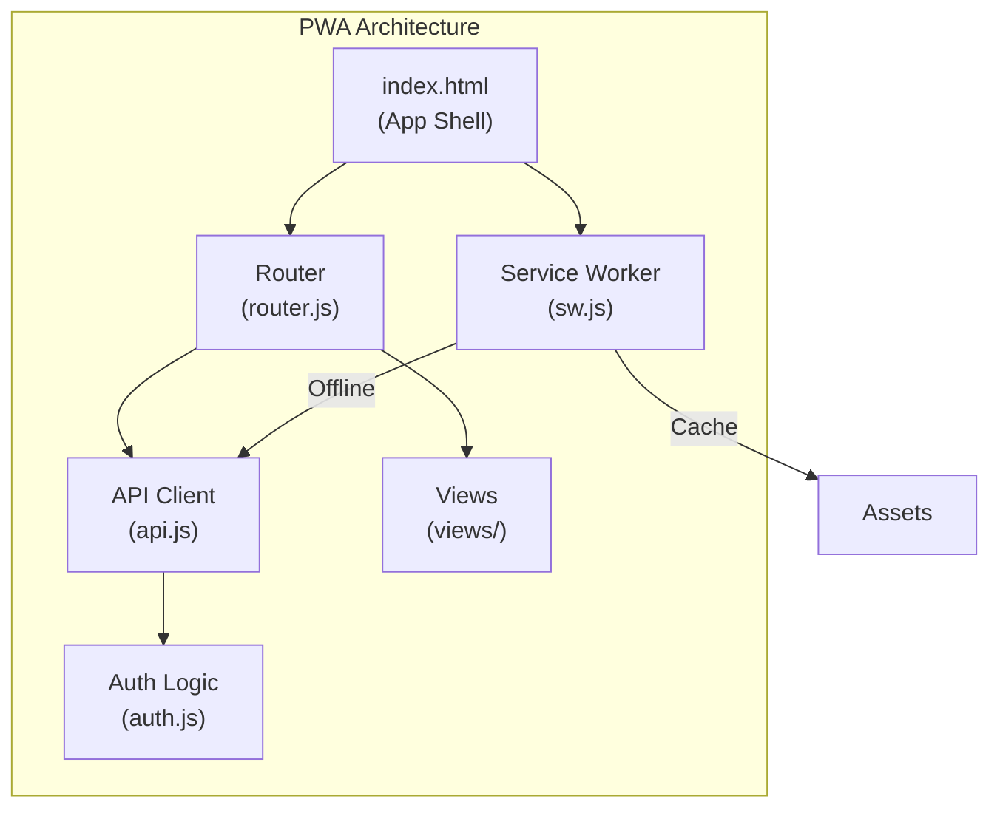
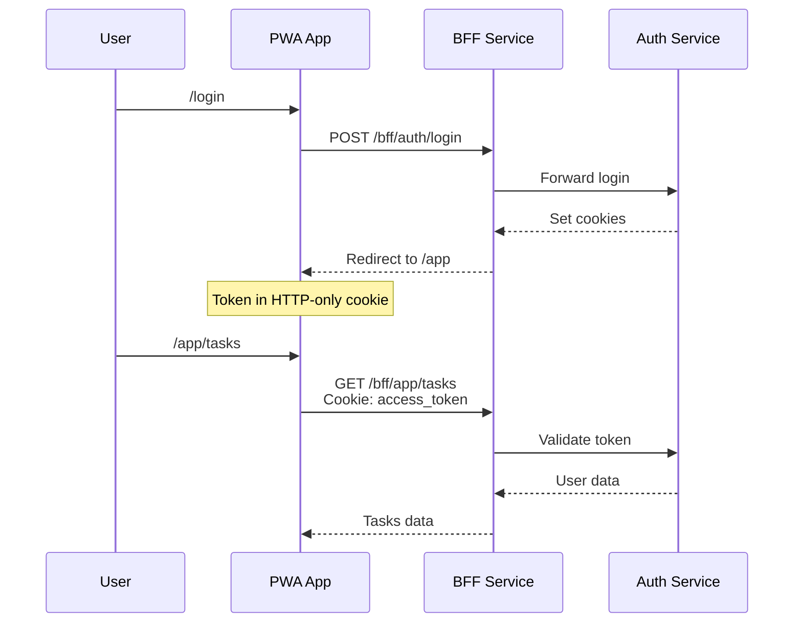

# PWA App

The **Goalixa PWA** is a single-page application frontend combining authentication and main app experience as an installable Progressive Web App.

## Overview

Goalixa PWA is built with vanilla JavaScript and provides:
- Unified Auth + App experience
- Offline support via Service Worker
- Custom client-side routing
- Installable (PWA)



## Project Structure

```
goalixa-pwa/
├── index.html              # Main app shell
├── manifest.webmanifest   # PWA manifest
├── sw.js                  # Service worker
├── js/
│   ├── router.js          # Client-side routing
│   ├── api.js             # API client
│   ├── auth.js            # Authentication logic
│   ├── config.js          # Configuration
│   ├── utils.js           # Utilities
│   ├── theme.js           # Theme handling
│   ├── charts.js          # Chart rendering
│   ├── pomodoro.js        # Pomodoro timer
│   └── views/
│       ├── auth-view.js   # Login/Signup views
│       ├── app-view.js    # Main app view
│       └── sessions-view.js
├── css/
│   └── styles.css
└── assets/
    └── icons/
```

## Routes

### Auth Routes
| Path | View | Description |
|------|------|-------------|
| `/login` | LoginView | User login |
| `/signup` | SignupView | User registration |
| `/forgot-password` | ForgotPasswordView | Password reset request |
| `/reset-password` | ResetPasswordView | Password reset |

### App Routes
| Path | View | Description |
|------|------|-------------|
| `/app` | AppView | Main app container |
| `/app/tasks` | TasksView | Task management |
| `/app/projects` | ProjectsView | Project management |
| `/app/goals` | GoalsView | Goal tracking |
| `/app/habits` | HabitsView | Habit tracking |
| `/app/reports` | ReportsView | Reports & analytics |
| `/app/settings` | SettingsView | User settings |

## API Client

```javascript
// API base configuration
const API_BASE = 'https://api.goalixa.com/bff';

// Making requests
const tasks = await api.get('/app/tasks');
const task = await api.post('/app/tasks', {
    title: 'New task',
    priority: 'high'
});
```

## Authentication Flow



## Service Worker

The Service Worker provides offline functionality:

```javascript
// sw.js capabilities
- Cache static assets (HTML, CSS, JS, fonts)
- Cache API responses for offline access
- Background sync for offline actions
- Push notification support
```

### Caching Strategy

| Resource Type | Strategy |
|---------------|----------|
| Static assets | Cache First |
| API responses | Network First |
| Images | Cache First |
| Offline fallback | Cache Only |

## PWA Features

### Installability

```json
// manifest.webmanifest
{
  "name": "Goalixa",
  "short_name": "Goalixa",
  "start_url": "/",
  "display": "standalone",
  "background_color": "#111827",
  "theme_color": "#111827",
  "icons": [
    {
      "src": "/assets/icons/icon-192.png",
      "sizes": "192x192",
      "type": "image/png"
    },
    {
      "src": "/assets/icons/icon-512.png",
      "sizes": "512x512",
      "type": "image/png"
    }
  ]
}
```

### Offline Support

When offline, the PWA:
- Shows cached content
- Queues actions for sync
- Displays offline indicator

## Code Examples

### Creating a Task

```javascript
// Via API client
const task = await api.post('/app/tasks', {
    title: 'Complete documentation',
    description: 'Write API docs',
    priority: 'high',
    project_id: 1,
    due_date: '2026-04-15'
});

console.log('Task created:', task.id);
```

### Timer Operations

```javascript
// Start timer on task
await api.post('/app/tasks/123/start');

// Stop timer
const entry = await api.post('/app/tasks/123/stop');
console.log('Time logged:', entry.duration, 'seconds');
```

### Handling Offline

```javascript
// Check online status
window.addEventListener('online', () => {
    showNotification('Back online!');
    syncOfflineActions();
});

window.addEventListener('offline', () => {
    showNotification('You are offline');
});
```

## Configuration

```javascript
// js/config.js
const CONFIG = {
    API_BASE: 'https://api.goalixa.com/bff',
    WS_BASE: 'wss://api.goalixa.com',
    OFFLINE_STORAGE: 'goalixa-offline',
    CACHE_VERSION: 'v1'
};
```

## Deployment

### Nginx Configuration

```nginx
server {
    listen 80;
    server_name app.goalixa.com;

    root /var/www/goalixa-pwa;
    index index.html;

    location / {
        try_files $uri $uri/ /index.html;
    }

    location /assets {
        expires 1y;
        add_header Cache-Control "public, immutable";
    }

    # API proxy
    location /bff {
        proxy_pass http://bff-service:8000;
        proxy_set_header Host $host;
        proxy_set_header X-Real-IP $remote_addr;
    }
}
```

### Docker

```dockerfile
FROM nginx:alpine
COPY . /usr/share/nginx/html
EXPOSE 80
CMD ["nginx", "-g", "daemon off;"]
```

## Features

| Feature | Status |
|---------|--------|
| Task Management | ✅ |
| Project Management | ✅ |
| Goal Tracking | ✅ |
| Habit Tracking | ✅ |
| Time Tracking | ✅ |
| Pomodoro Timer | ✅ |
| Reports & Charts | ✅ |
| Offline Mode | ✅ |
| PWA Install | ✅ |
| Dark/Light Theme | ✅ |
| Keyboard Shortcuts | ✅ |
