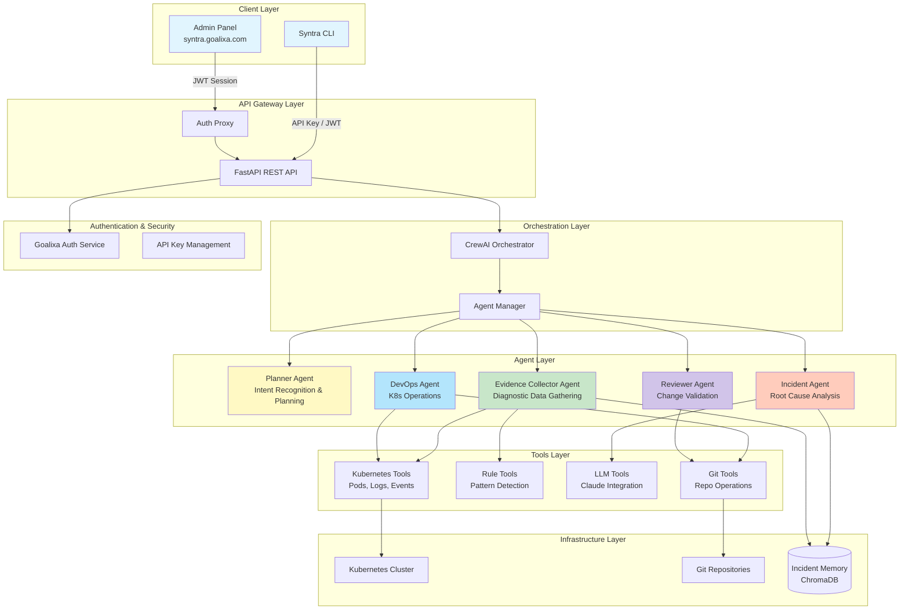
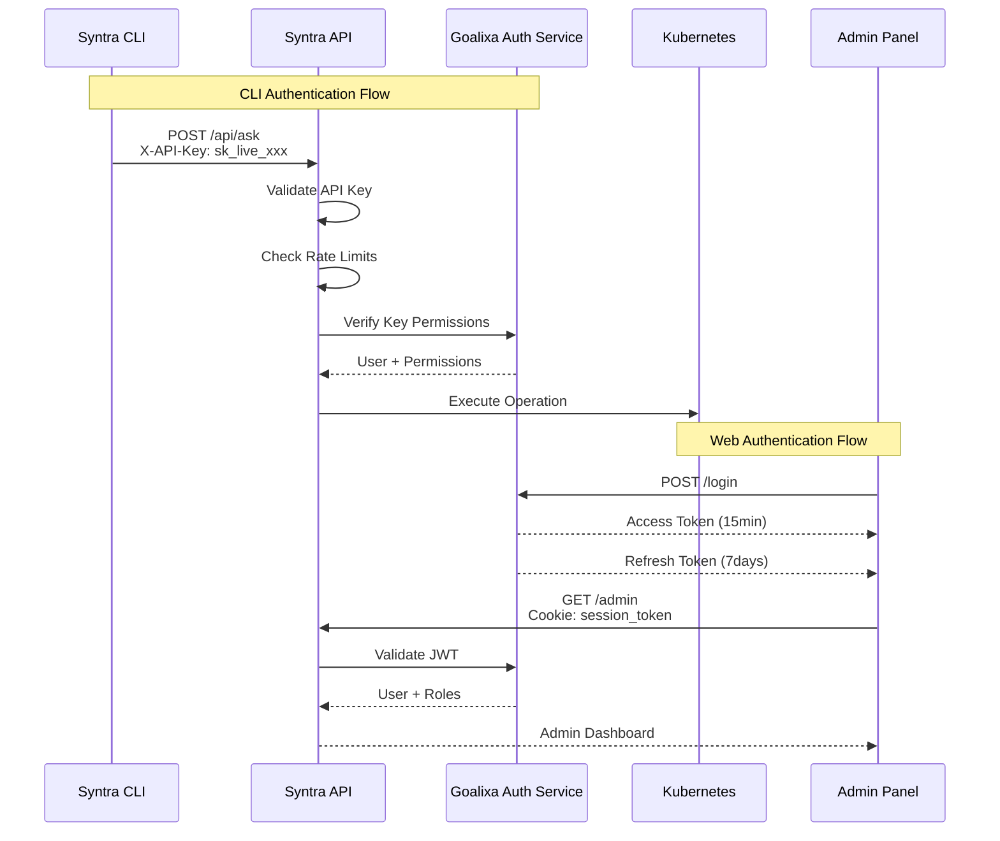
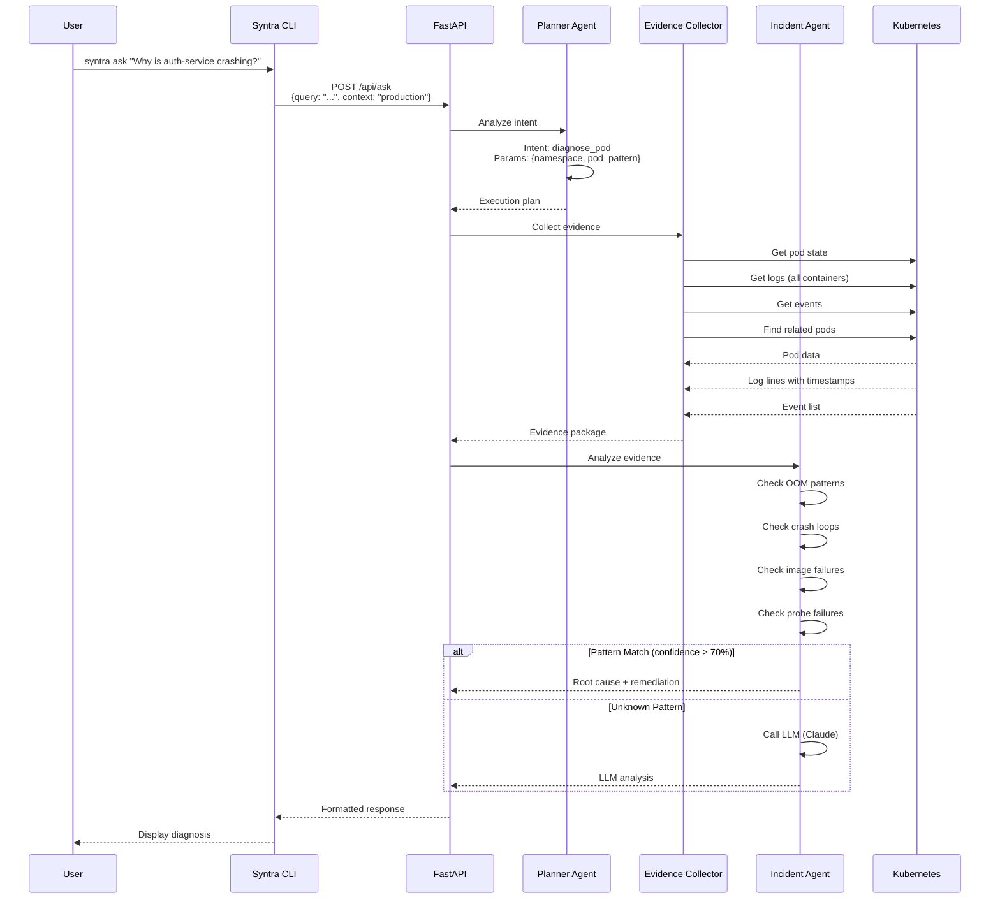
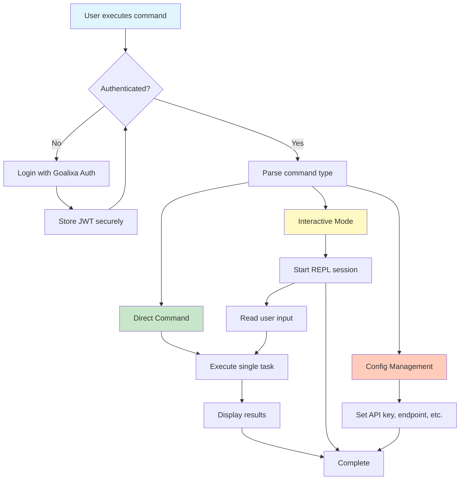
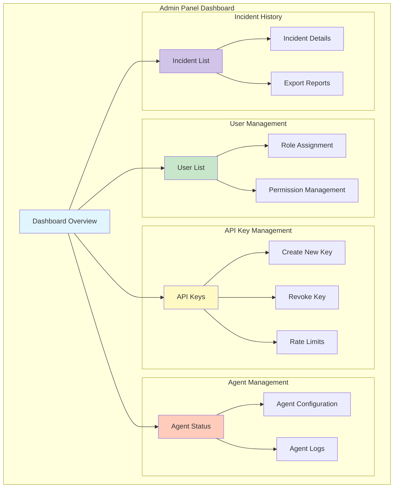
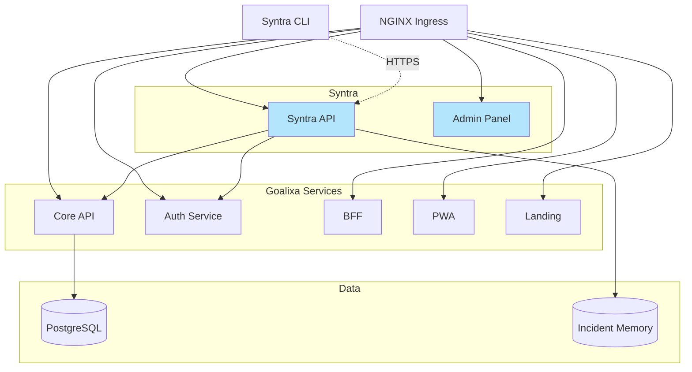
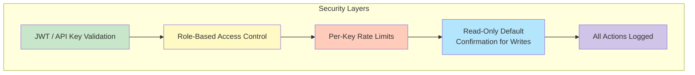
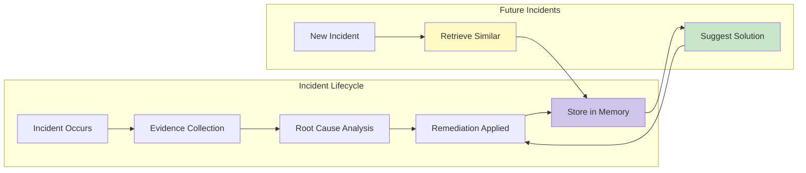

# Syntra Architecture: Deep Dive into AI DevOps Orchestration

> **Published:** 2026-04-03 | **Section:** AI & Automation | **Author:** Amirreza Rezaie

## Overview

**Syntra** is the central AI teammate for the Goalixa platform — an intelligent orchestration service that manages incidents, automates DevOps workflows, and provides seamless Kubernetes cluster management through a multi-agent system powered by CrewAI.

### What Syntra Solves

As a solo developer building Goalixa, I faced three critical challenges:

1. **Incident Management Overload** - Debugging production issues across multiple microservices
2. **Context Switching** - Constantly moving between development, deployment, and operations
3. **Operational Complexity** - Managing Kubernetes clusters, Git repositories, and service health

Syntra addresses these by acting as an **always-available DevOps teammate** that:
- Investigates incidents automatically
- Manages Kubernetes operations with AI
- Provides a unified CLI interface for all operations
- Learns from past incidents to improve future responses

---

## System Architecture

### High-Level Architecture



---

## Agent System Design

### Agent Hierarchy & Responsibilities

```mermaid
graph LR
    subgraph "Intent Recognition"
        Planner[Planner Agent]
    end

    subgraph "Diagnostic Phase"
        Evidence[Evidence Collector]
    end

    subgraph "Analysis Phase"
        Incident[Incident Agent]
    end

    subgraph "Execution Phase"
        DevOps[DevOps Agent]
    end

    subgraph "Validation Phase"
        Reviewer[Reviewer Agent]
    end

    Planner -->|1. Analyze Request| Evidence
    Evidence -->|2. Collect Data| Incident
    Incident -->|3. Root Cause| DevOps
    DevOps -->|4. Execute Fix| Reviewer
    Reviewer -->|5. Validate| END[Complete]

    style Planner fill:#fff9c4
    style Evidence fill:#c8e6c9
    style Incident fill:#ffccbc
    style DevOps fill:#b3e5fc
    style Reviewer fill:#d1c4e9
```



### Agent Detailed Specifications

#### 1. Planner Agent - The Incident Commander

**Role:** Intent Recognition & Workflow Orchestration

**Capabilities:**
- Natural language request parsing
- Intent classification (diagnose_pod, namespace_overview, collect_evidence, general_help)
- Execution plan generation
- Required information identification
- Agent delegation

**Input Example:**
```
"Investigate why the auth-service pod is crashing in production"
```

**Output:**
```json
{
  "intent": "diagnose_pod",
  "required_params": {
    "namespace": "production",
    "pod_name": "auth-service-*"
  },
  "execution_plan": [
    "EvidenceCollector: Gather pod state, logs, events",
    "IncidentAgent: Analyze patterns and detect root cause",
    "DevOps: Suggest remediation if safe operation detected"
  ]
}
```

---

#### 2. Evidence Collector Agent - The Detective

**Role:** Diagnostic Data Gathering

**Capabilities:**
- Pod state inspection (all containers)
- Log collection with timestamps
- Event filtering and correlation
- Related pod discovery (same deployment, replica sets)
- Kubernetes connectivity verification

**Evidence Package Structure:**
```json
{
  "pod_name": "auth-service-7d4f8b9c-x2k4p",
  "namespace": "production",
  "evidence": {
    "pod_state": {
      "phase": "Running",
      "containers": [
        {
          "name": "auth-service",
          "state": "waiting",
          "reason": "CrashLoopBackOff",
          "restart_count": 5
        }
      ]
    },
    "logs": [
      {
        "container": "auth-service",
        "timestamp": "2026-04-03T10:23:45Z",
        "message": "Connection refused: postgres.goalixa.svc:5432"
      }
    ],
    "events": [
      {
        "type": "Warning",
        "reason": "BackOff",
        "message": "Back-off restarting failed container"
      }
    ],
    "related_pods": [
      "auth-service-7d4f8b9c-y5k7m",
      "auth-service-7d4f8b9c-z9j2n"
    ]
  }
}
```

---

#### 3. Incident Agent - The Analyst

**Role:** Root Cause Analysis & Pattern Detection

**Dual Approach:**

**1. Rule-Based Detection (First Pass)**
- OOM (Out of Memory) kills
- CrashLoopBackOff patterns
- Image pull failures
- Probe failures (readiness/liveness)

**2. LLM Fallback (Unknown Issues)**
- Complex multi-factor failures
- Novel error patterns
- Cross-service dependencies

**Detection Confidence Threshold:** 70%
- Below 70%: Escalate to LLM (Claude)
- Above 70%: Provide rule-based diagnosis

**Output Example:**
```json
{
  "root_cause": {
    "type": "database_connection_failure",
    "confidence": 0.85,
    "detection_method": "rule_based",
    "evidence": [
      "Connection refused error in logs",
      "Database pod not found in namespace",
      "Service endpoint missing"
    ]
  },
  "remediation": {
    "immediate": "Check if PostgreSQL deployment exists in production namespace",
    "verification": "kubectl get pods -n production -l app=postgres",
    "prevention": "Add dependency check in deployment pipeline"
  }
}
```

---

#### 4. DevOps Agent - The Executor

**Role:** Kubernetes Operations Execution

**Capabilities:**
- Pod inspection and status checks
- Log retrieval and filtering
- Service and deployment queries
- Safe operations (read-only by default)
- Namespace overviews

**Safety Model:**
- Default: Read-only access
- Write operations require explicit confirmation
- Destructive operations (delete, scale down) blocked in CLI

---

#### 5. Reviewer Agent - The Validator

**Role:** Change Validation & Quality Assurance

**Capabilities:**
- Execution result validation
- Error detection and reporting
- Best practices compliance checking
- Incident history correlation

---

## Authentication & Authorization

### Dual Authentication System

Syntra implements two authentication mechanisms for different use cases:



### API Key Authentication (CLI)

**Endpoint:** `POST /api/ask`

**Headers:**
```
X-API-Key: sk_live_abc123...
Content-Type: application/json
```

**Rate Limits:**
- 60 requests/minute
- 1000 requests/hour
- Per-key limits

**Key Types:**
| Key Prefix | Type | Permissions |
|------------|------|-------------|
| `sk_live_` | Production | Full access |
| `sk_test_` | Test | Read-only |
| `sk_admin_` | Admin | All + key management |

### JWT Authentication (Admin Panel)

**Token Structure:**

**Access Token (15-minute TTL):**
```json
{
  "user_id": "user_abc123",
  "email": "user@example.com",
  "roles": ["admin", "developer"],
  "permissions": [
    "kubernetes:read",
    "kubernetes:write",
    "incident:create"
  ],
  "exp": 1714876800
}
```

**Refresh Token (7-day TTL):**
- Stored in HTTP-only cookie
- Auto-rotates on refresh
- Revoked on logout/password change

---

## Data Flow: Incident Investigation

### Complete Incident Response Flow



---

## CLI Workflow

### Syntra CLI Interface



### CLI Commands

```bash
# Authentication
syntra login                    # Authenticate with Goalixa Auth
syntra logout                   # Logout and clear credentials
syntra status                   # Show authentication status

# Direct Commands
syntra ask "diagnose pod auth-service"    # Single task execution
syntra health                   # Check Syntra service health
syntra agents                   # List available agents
syntra tools                    # List available tools

# Interactive Mode
syntra                          # Start interactive REPL
syntra repl --enhanced          # Enhanced REPL with history

# Configuration
syntra config set endpoint https://syntra.goalixa.com
syntra config set api-key sk_live_abc123
syntra config list              # Show all configuration
```

---

## Admin Panel

### Admin Panel Features



---

## Technology Stack

### Core Technologies

| Component | Technology | Purpose |
|-----------|------------|---------|
| **API Framework** | FastAPI | High-performance REST API |
| **AI Orchestration** | CrewAI | Multi-agent coordination |
| **LLM Integration** | LangChain + Claude | Advanced reasoning |
| **Kubernetes** | Python K8s Client | Cluster operations |
| **CLI** | Typer + Rich | Beautiful command-line interface |
| **Authentication** | Goalixa Auth | Centralized auth service |
| **Vector DB** | ChromaDB (planned) | Incident memory |
| **Python Version** | 3.11+ | Runtime |

---

## Deployment Architecture

### Kubernetes Deployment



---

## Security Model

### Defense in Depth



### Security Features

1. **Authentication**
   - JWT tokens with short TTL (15 minutes)
   - API key rotation support
   - HTTP-only cookies for web sessions

2. **Authorization**
   - Role-based access control (RBAC)
   - Granular permissions per operation
   - Namespace-level isolation

3. **Rate Limiting**
   - Per-key limits (60 req/min, 1000 req/hour)
   - IP-based fallback limits
   - Configurable per user role

4. **Agent Safety**
   - Read-only by default
   - Explicit confirmation for destructive ops
   - Operation validation before execution

5. **Audit Trail**
   - All actions logged with user context
   - Incident history tracking
   - Change attribution

---

## Incident Memory System

### Learning from Past Incidents



### Memory Structure (Planned with ChromaDB)

```json
{
  "incident_id": "inc_20260403_001",
  "timestamp": "2026-04-03T10:23:45Z",
  "namespace": "production",
  "affected_resources": ["auth-service-7d4f8b9c-x2k4p"],
  "symptoms": [
    "CrashLoopBackOff",
    "Connection refused to postgres"
  ],
  "root_cause": {
    "type": "database_connection_failure",
    "confidence": 0.85
  },
  "remediation": {
    "action": "deployed missing postgres service",
    "verified": true
  },
  "tags": ["database", "connectivity", "missing-dependency"],
  "embedding": [0.123, 0.456, ...]  // Vector embedding for similarity search
}
```

---

## Current Status & Roadmap

### Implementation Status

**Implemented ✅**
- PlannerAgent with intent recognition
- EvidenceCollectorAgent with K8s integration
- IncidentAgent with rule-based detection
- FastAPI REST API with authentication
- Kubernetes tools (pod state, logs, events)
- CLI framework (basic)
- Admin panel authentication proxy
- API key management with rate limiting

**In Progress 🚧**
- LLM integration (Claude) for complex incidents
- ChromaDB incident memory
- Complete CLI implementation
- Enhanced admin panel

**Planned 📋**
- DevOpsAgent full implementation
- ReviewerAgent full implementation
- Git operations tools
- Multi-cluster support
- Advanced analytics dashboard
- Self-healing automation
- Slack/Discord integration

---

## Key Takeaways

1. **Syntra is a Central AI Teammate** - Not just a tool, but an intelligent assistant that learns and collaborates

2. **Multi-Agent Architecture** - Specialized agents handle different aspects of incident response

3. **Dual Authentication** - Supports both API keys (CLI) and JWT (web) for different use cases

4. **Hybrid AI Approach** - Fast rule-based detection + LLM fallback for complex issues

5. **Safety First** - Multiple security layers, read-only defaults, explicit confirmations

6. **Continuous Learning** - Incident memory system improves future responses

---

## Related Posts

- [Using Claude for Goalixa](../software-engineering/using-claude-for-goalixa.md) - AI development workflow
- [ArgoCD Setup: First Step](../gitops/argocd-first-step.md) - GitOps infrastructure
- [Monitoring Stack Setup](../monitoring-stack-prometheus-grafana-alertmanager.md) - Observability

---

## Connect & Explore

**Syntra Repository:** [https://github.com/goalixa/syntra](https://github.com/goalixa/syntra)

**Goalixa Project:** [https://github.com/goalixa](https://github.com/goalixa)

**Live Demo:** [https://syntra.goalixa.com](https://syntra.goalixa.com)

---

**Tags:** `#ai` `#architecture` `#devops` `#multi-agent` `#kubernetes` `#system-design` `#crewai` `#orchestration`
