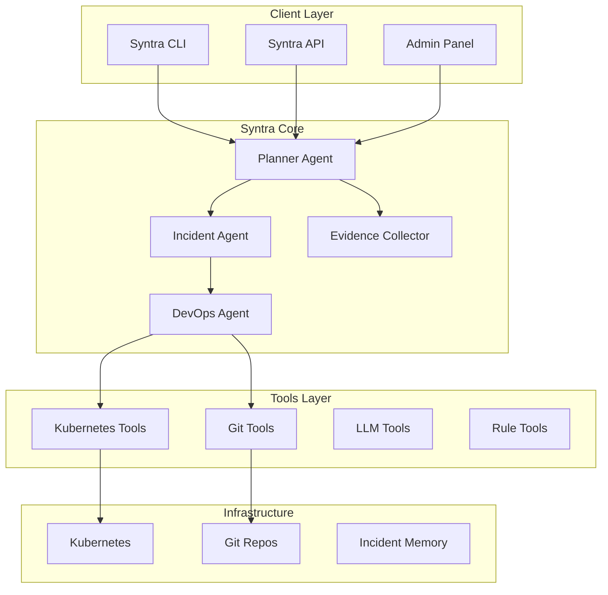
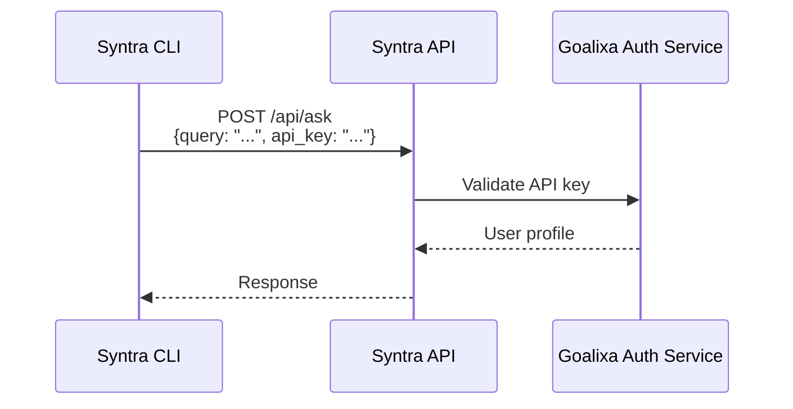

# Syntra

**Syntra** is the central AI teammate for the Goalixa platform — an intelligent orchestration service that manages incidents, automates DevOps workflows, and provides seamless Kubernetes cluster management through a multi-agent system powered by CrewAI.

## Overview

Syntra acts as an always-available DevOps teammate that:
- Investigates incidents automatically
- Manages Kubernetes operations with AI
- Provides a unified CLI interface for all operations
- Learns from past incidents to improve future responses



## Technology Stack

| Component | Technology |
|-----------|------------|
| **Framework** | FastAPI |
| **AI Orchestration** | CrewAI |
| **LLM Integration** | LangChain + Claude |
| **Kubernetes** | Python K8s Client |
| **CLI** | Typer + Rich |
| **Authentication** | Goalixa Auth |

## Project Structure

```
syntra/
├── main.py                    # Entry point
├── config.py                  # Configuration
├── api/                       # FastAPI routes
│   ├── main.py
│   ├── routes.py
│   ├── auth_routes.py
│   ├── admin_routes.py
│   └── schemas.py
├── agents/                    # CrewAI agents
│   ├── base_agent/
│   ├── planner_agent/
│   ├── incident_agent/
│   ├── evidence_collector/
│   ├── devops_agent/
│   └── tools/
├── skills/                    # Skill modules
│   ├── devops/
│   ├── incident/
│   ├── review/
│   └── planning/
├── tools/                     # Tool implementations
│   ├── kubernetes_tools/
│   ├── git_tools/
│   ├── log_tools/
│   └── llm_tools/
├── services/
│   └── k8s_service.py
└── orchestration/
    └── crew_runner.py
```

## API Endpoints

### Main Routes

| Method | Endpoint | Description |
|--------|----------|-------------|
| POST | `/api/ask` | Ask a question |
| GET | `/api/agents` | List agents |
| GET | `/api/agents/<id>/status` | Agent status |
| POST | `/api/agents/<id>/cancel` | Cancel agent |

### Health

| Method | Endpoint | Description |
|--------|----------|-------------|
| GET | `/health` | Health check |
| GET | `/ready` | Readiness probe |

## Agent System

### Planner Agent
- Intent recognition and task decomposition
- Coordinates other agents
- Manages workflow execution

### Incident Agent
- Automatic incident detection
- Root cause analysis
- Resolution recommendations

### Evidence Collector
- Log collection and correlation
- Event filtering
- Related pod discovery

### DevOps Agent
- Kubernetes operations
- Pod inspection and status
- Deployment management

## Code Examples

### Asking a Question

```bash
curl -X POST http://localhost:8000/api/ask \
  -H "Content-Type: application/json" \
  -H "Authorization: Bearer <token>" \
  -d '{
    "query": "Why is auth-service crashing?",
    "context": "production"
  }'
```

**Response:**
```json
{
  "task_id": "abc123",
  "status": "processing",
  "message": "Investigation started"
}
```

### Checking Agent Status

```bash
curl -X GET http://localhost:8000/api/agents/abc123/status \
  -H "Authorization: Bearer <token>"
```

**Response:**
```json
{
  "agent_id": "abc123",
  "status": "completed",
  "result": {
    "root_cause": "OOMKilled",
    "recommendation": "Increase memory limit"
  }
}
```

## Configuration

### Environment Variables

| Variable | Description | Default |
|----------|-------------|---------|
| `OPENAI_API_KEY` | OpenAI API key | Required |
| `ANTHROPIC_API_KEY` | Anthropic API key | Required |
| `KUBECONFIG` | Kubernetes config path | ~/.kube/config |
| `AUTH_SERVICE_URL` | Auth service URL | http://localhost:5001 |

## Kubernetes Deployment

```yaml
apiVersion: apps/v1
kind: Deployment
metadata:
  name: syntra
spec:
  replicas: 2
  selector:
    matchLabels:
      app: syntra
  template:
    metadata:
      labels:
        app: syntra
    spec:
      containers:
      - name: syntra
        image: goalixa/syntra:latest
        ports:
        - containerPort: 8000
        env:
        - name: OPENAI_API_KEY
          valueFrom:
            secretKeyRef:
              name: goalixa-secrets
              key: openai-api-key
        - name: ANTHROPIC_API_KEY
          valueFrom:
            secretKeyRef:
              name: goalixa-secrets
              key: anthropic-api-key
        resources:
          requests:
            memory: "512Mi"
            cpu: "500m"
```

## Authentication

Syntra implements two authentication mechanisms:

1. **CLI Authentication** - API key-based
2. **Admin Panel** - JWT via Goalixa Auth


