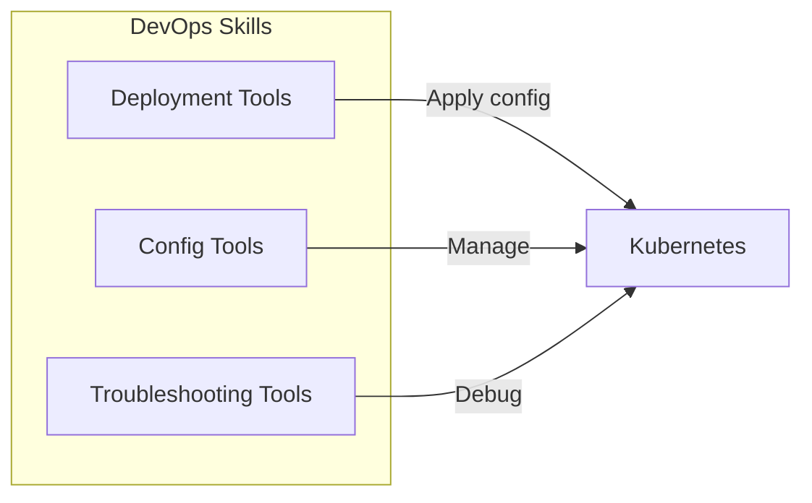

# Syntra Skills

Syntra uses a skill-based architecture where each skill module provides specialized capabilities for different operational scenarios.

## Skill Categories

### 1. DevOps Skills

Capabilities for deployment, configuration, and troubleshooting.



**Tools:**
- Deployment management
- Configuration updates
- Troubleshooting and debugging
- Log analysis

### 2. Incident Skills

Automated incident detection and response.

**Capabilities:**
- Root cause analysis
- Incident classification
- Automated remediation
- Post-incident learning

### 3. Review Skills

Code and configuration review capabilities.

**Capabilities:**
- Git commit analysis
- Pull request review
- Security scanning
- Best practices validation

### 4. Planning Skills

Strategic planning and task decomposition.

**Capabilities:**
- Intent recognition
- Task breakdown
- Resource estimation
- Timeline planning

## Code Structure

```
skills/
├── base_skill.py           # Base skill class
├── __init__.py
├── devops/
│   ├── __init__.py
│   └── tools/
│       ├── deployment_tools.py
│       ├── config_tools.py
│       └── troubleshooting_tools.py
├── incident/
│   └── ...
├── review/
│   └── ...
└── planning/
    └── ...
```

## Usage Example

```python
from syntra.skills.devops import DevOpsSkill

skill = DevOpsSkill()

# Apply deployment
await skill.apply_deployment(
    manifest="deployment.yaml",
    namespace="production"
)

# Get pod status
pods = await skill.get_pod_status(
    namespace="production",
    label="app=web"
)
```

## Integration with Agents

Skills are used by the multi-agent system:

1. **Planner Agent** → Uses Planning skills
2. **DevOps Agent** → Uses DevOps skills
3. **Incident Agent** → Uses Incident skills
4. **Review Agent** → Uses Review skills
