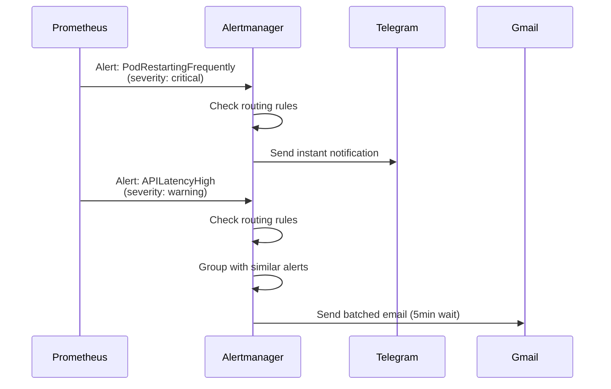

import PostMeta from '../../../components/PostMeta'
import { CalloutInfo, CalloutWarning, CalloutSuccess } from '../../../components/Callout'

# Alertmanager: Intelligent Alerting

<PostMeta
  date="May 19, 2026"
  category="Observability"
  readTime="18 min"
/>

Metrics without alerts are just numbers. Alertmanager transforms Prometheus metrics into actionable notifications - ensuring you're notified when things break, but not overwhelmed by noise.

## Why Alertmanager?

- **Multi-channel routing**: Send critical alerts to Telegram, warnings to email
- **Alert grouping**: Combine related alerts to reduce noise
- **Inhibition rules**: Suppress redundant alerts automatically
- **Silencing**: Temporarily mute alerts during maintenance
- **Alert history**: Track alert patterns over time

## Production Configuration

### Current Setup

```yaml
Version: Bundled with kube-prometheus-stack
Active PrometheusRules: 35 across cluster
Storage: 2Gi Longhorn PVC
Notification Channels:
  - Telegram Bot (critical alerts)
  - Gmail SMTP (warning alerts)
Last 30 Days Stats:
  - Total Alerts: 47
  - Critical: 12 (25.5%)
  - Warnings: 35 (74.5%)
  - False Positives: 3 (6.4%)
  - MTTA: 4 minutes
  - MTTR: 23 minutes
```

## Alert Design Principles

Before writing alerts, understand what makes a good alert.

### The Four Principles

**1. Actionable**
Every alert must require a specific action. If you can't answer "what do I do about this?", it's not an alert—it's information.

**Bad**: `HighMemoryUsage - Memory is at 60%`
**Good**: `HighMemoryUsage - Memory at 85% for 10 minutes. Risk of OOM kill. Check for memory leaks or scale up.`

**2. Severity-Appropriate**
Match alert severity to required response time.

| Severity | Response Time | Examples | Action |
|----------|---------------|----------|--------|
| **Critical** | Immediate (< 5 min) | Service down, data loss risk, security breach | Wake up on-call engineer |
| **Warning** | Soon (< 1 hour) | High resource usage, slow responses, upcoming issues | Check during business hours |
| **Info** | Eventually (< 1 day) | Successful deployments, config changes | Log only, no notification |

**3. Low False-Positive Rate**
Alert fatigue is real. Aim for < 10% false positive rate.

**Bad**: Alert on any 500 error (false alarms from retries)
**Good**: Alert on 5xx error rate > 5% for 5 minutes

**4. Clear Context**
Annotations should explain:
- What's wrong (summary)
- Why it matters (description)
- What to do (runbook link)

```yaml
annotations:
  summary: "Pod {{ $labels.pod }} memory at {{ $value }}%"
  description: "Memory usage above 80% for 5 minutes. Risk of OOM kill."
  runbook_url: "https://docs.goalixa.com/runbooks/high-memory"
```

<CalloutSuccess title="✅ The Golden Rule">
**If an alert doesn't wake you up or make you take action, it shouldn't notify you.** Use **metrics** for information, **alerts** for action.
</CalloutSuccess>

## PrometheusRules: Defining Alerts

PrometheusRules are CustomResourceDefinitions (CRDs) that define when alerts should fire.

### Alert Anatomy

```yaml
apiVersion: monitoring.coreos.com/v1
kind: PrometheusRule
metadata:
  name: goalixa-alerts
  namespace: monitoring
  labels:
    prometheus: kube-prometheus  # Required for discovery
spec:
  groups:
    - name: infrastructure.rules
      interval: 30s  # How often to evaluate rules
      rules:
        - alert: PodMemoryUsageHigh
          expr: |
            (container_memory_working_set_bytes{namespace=~"goalixa-.*"}
             / container_spec_memory_limit_bytes{namespace=~"goalixa-.*"}) > 0.8
          for: 5m  # Must be true for 5 minutes before firing
          labels:
            severity: warning
            component: infrastructure
            namespace: "{{ $labels.namespace }}"
          annotations:
            summary: "Pod {{ $labels.pod }} high memory usage"
            description: "Memory usage is {{ $value | humanizePercentage }} (threshold: 80%)"
            runbook_url: "https://docs.goalixa.com/runbooks/high-memory"
```

**Key Fields:**

- **expr**: PromQL query that returns >0 when alert should fire
- **for**: Duration condition must be true before firing (prevents flapping)
- **labels**: Metadata for routing (severity, component, etc.)
- **annotations**: Human-readable context (supports templating)

### Production Alert Examples

#### 1. Infrastructure Alerts

**High Memory Usage**:
```yaml
- alert: PodMemoryUsageHigh
  expr: |
    (container_memory_working_set_bytes{namespace=~"goalixa-.*"}
     / container_spec_memory_limit_bytes{namespace=~"goalixa-.*"}) > 0.8
  for: 5m
  labels:
    severity: warning
    component: infrastructure
  annotations:
    summary: "Pod {{ $labels.pod }} memory at {{ $value | humanizePercentage }}"
    description: "Memory usage above 80% for 5 minutes. Check for memory leaks or scale up."
    runbook_url: "https://docs.goalixa.com/runbooks/high-memory"
```

**Pod Restarting Frequently**:
```yaml
- alert: PodRestartingFrequently
  expr: |
    rate(kube_pod_container_status_restarts_total{namespace=~"goalixa-.*"}[15m]) > 0.2
  for: 0m  # Alert immediately
  labels:
    severity: critical
    component: infrastructure
  annotations:
    summary: "Pod {{ $labels.pod }} restarting frequently"
    description: "Pod has restarted {{ $value }} times in last 15 minutes. Likely crash loop."
    runbook_url: "https://docs.goalixa.com/runbooks/pod-restarts"
```

**Disk Space Critical**:
```yaml
- alert: NodeDiskSpaceCritical
  expr: |
    (node_filesystem_avail_bytes{mountpoint="/"}
     / node_filesystem_size_bytes{mountpoint="/"}) < 0.15
  for: 10m
  labels:
    severity: critical
    component: infrastructure
  annotations:
    summary: "Node {{ $labels.instance }} low disk space"
    description: "Only {{ $value | humanizePercentage }} disk space remaining"
    runbook_url: "https://docs.goalixa.com/runbooks/disk-space"
```

#### 2. Application Alerts

**API Latency High**:
```yaml
- alert: APILatencyHigh
  expr: |
    histogram_quantile(0.95,
      rate(goalixa_http_request_duration_seconds_bucket{job="core-api"}[5m])
    ) > 1.0
  for: 5m
  labels:
    severity: warning
    component: application
    service: core-api
  annotations:
    summary: "API latency high on {{ $labels.route }}"
    description: "P95 latency is {{ $value }}s (SLO: 1s)"
    runbook_url: "https://docs.goalixa.com/runbooks/api-latency"
```

**High Error Rate**:
```yaml
- alert: HighErrorRate
  expr: |
    sum(rate(goalixa_http_requests_total{status_code=~"5..",job="core-api"}[5m]))
      / sum(rate(goalixa_http_requests_total{job="core-api"}[5m])) > 0.05
  for: 5m
  labels:
    severity: critical
    component: application
    service: core-api
  annotations:
    summary: "High 5xx error rate on Core-API"
    description: "Error rate is {{ $value | humanizePercentage }} (threshold: 5%)"
    runbook_url: "https://docs.goalixa.com/runbooks/high-errors"
```

#### 3. Security Alerts

**Certificate Expiring Soon**:
```yaml
- alert: CertificateExpirationSoon
  expr: |
    (certmanager_certificate_expiration_timestamp_seconds - time()) / 86400 < 30
  for: 0m
  labels:
    severity: warning
    component: security
  annotations:
    summary: "Certificate {{ $labels.name }} expiring soon"
    description: "Certificate expires in {{ $value }} days"
    runbook_url: "https://docs.goalixa.com/runbooks/cert-renewal"
```

### Alert Rule Best Practices

<CalloutInfo title="💡 PromQL Tips for Alerts">
**1. Always use `rate()` for counters:**
```promql
# Bad: Counters reset on pod restart
http_requests_total > 1000

# Good: Rate handles resets correctly
rate(http_requests_total[5m]) > 10
```

**2. Choose appropriate time windows:**
```promql
[1m]  - Too sensitive, lots of false positives
[5m]  - Good for application alerts
[15m] - Good for infrastructure trends
[1h]  - Good for capacity planning alerts
```

**3. Use `for:` to prevent flapping:**
```yaml
for: 5m  # Must be true for 5 minutes
```

**4. Label consistently:**
```yaml
labels:
  severity: critical|warning|info
  component: infrastructure|application|security|business
  service: core-api|auth|bff
```
</CalloutInfo>

## Multi-Channel Notifications

Alertmanager routes alerts to different notification channels based on labels and matchers.

### Notification Architecture



### Setting Up Telegram Notifications

**Step 1: Create Telegram Bot**

1. Open Telegram, search for `@BotFather`
2. Send `/newbot` command
3. Follow prompts:
   - Bot name: `Your Project Alerts`
   - Username: `your_project_alerts_bot`
4. Save bot token: `<YOUR_BOT_TOKEN>` (format: `123456789:ABCdefGHIjklMNOpqrsTUVwxyz`)

**Step 2: Get Chat ID**

```bash
# Start chat with your bot, send any message
# Then run:
curl https://api.telegram.org/bot<YOUR_BOT_TOKEN>/getUpdates

# Response includes:
{
  "update_id": 123456789,
  "message": {
    "chat": {
      "id": 123456789,  # <- This is your chat_id
      "type": "private"
    }
  }
}
```

**Step 3: Test Bot**

```bash
curl -X POST "https://api.telegram.org/bot<YOUR_BOT_TOKEN>/sendMessage" \
  -d "chat_id=<YOUR_CHAT_ID>" \
  -d "text=🚨 Test alert from monitoring system"
```

### Setting Up Gmail Notifications

**Step 1: Generate App Password**

1. Go to [Google Account Settings](https://myaccount.google.com/)
2. Security → 2-Step Verification (enable if not already)
3. Security → App passwords
4. Select app: Mail
5. Select device: Other (Custom name: "Project Alertmanager")
6. Click Generate
7. Copy 16-character password: `<YOUR_APP_PASSWORD>` (format: `abcd efgh ijkl mnop`)

**Step 2: Test SMTP**

```bash
# Install swaks (SMTP test tool)
apt-get install swaks  # Ubuntu/Debian
brew install swaks     # macOS

# Test Gmail SMTP
swaks --to your-email@gmail.com \
      --from your-email@gmail.com \
      --server smtp.gmail.com:587 \
      --auth LOGIN \
      --auth-user your-email@gmail.com \
      --auth-password "<YOUR_APP_PASSWORD>" \
      --tls \
      --header "Subject: Test Alert" \
      --body "Test message from Alertmanager"
```

### Alertmanager Configuration

**Step 1: Create Kubernetes Secret**

```bash
kubectl create secret generic alertmanager-credentials -n monitoring \
  --from-literal=telegram-bot-token='<YOUR_BOT_TOKEN>' \
  --from-literal=telegram-chat-id='<YOUR_CHAT_ID>' \
  --from-literal=gmail-password='<YOUR_APP_PASSWORD>' \
  --dry-run=client -o yaml | kubectl apply -f -
```

**Step 2: Configure Alertmanager via Helm**

```yaml
# values-production.yaml (add to existing file)
alertmanager:
  config:
    global:
      resolve_timeout: 5m
      smtp_smarthost: 'smtp.gmail.com:587'
      smtp_from: 'alerts@yourdomain.com'
      smtp_auth_username: 'your-email@gmail.com'
      smtp_auth_password: '<YOUR_APP_PASSWORD>'
      smtp_require_tls: true

    # Inhibit rules - prevent alert spam
    inhibit_rules:
      # Critical alerts suppress warnings with same alertname
      - source_matchers:
          - severity = critical
        target_matchers:
          - severity =~ warning|info
        equal:
          - namespace
          - alertname

      # During pod restarts, suppress memory alerts
      - source_matchers:
          - alertname = PodRestartingFrequently
        target_matchers:
          - alertname = PodMemoryUsageHigh
        equal:
          - namespace
          - pod

    # Receivers - where to send alerts
    receivers:
      - name: 'null'  # Discard alerts

      - name: 'telegram-critical'
        telegram_configs:
          - bot_token: '<YOUR_BOT_TOKEN>'
            chat_id: <YOUR_CHAT_ID>
            parse_mode: 'HTML'
            message: |
              🚨 <b>{{ .GroupLabels.alertname }}</b>

              <b>Severity:</b> {{ .CommonLabels.severity }}
              <b>Component:</b> {{ .CommonLabels.component }}
              {{ if .CommonLabels.namespace }}<b>Namespace:</b> {{ .CommonLabels.namespace }}{{ end }}

              {{ range .Alerts }}
              <b>Alert:</b> {{ .Annotations.summary }}
              <b>Details:</b> {{ .Annotations.description }}
              {{ if .Annotations.runbook_url }}<a href="{{ .Annotations.runbook_url }}">📖 Runbook</a>{{ end }}

              <b>Started:</b> {{ .StartsAt.Format "15:04:05 MST" }}
              {{ end }}

      - name: 'gmail-warnings'
        email_configs:
          - to: 'your-email@gmail.com'
            headers:
              Subject: '[Goalixa Alert] {{ .GroupLabels.alertname }}'
            html: |
              <h2>⚠️ {{ .GroupLabels.alertname }}</h2>
              <p><strong>Severity:</strong> {{ .CommonLabels.severity }}</p>
              <p><strong>Component:</strong> {{ .CommonLabels.component }}</p>
              {{ if .CommonLabels.namespace }}<p><strong>Namespace:</strong> {{ .CommonLabels.namespace }}</p>{{ end }}

              {{ range .Alerts }}
              <h3>{{ .Annotations.summary }}</h3>
              <p>{{ .Annotations.description }}</p>
              <p><strong>Started:</strong> {{ .StartsAt.Format "2006-01-02 15:04:05 MST" }}</p>
              {{ if .Annotations.runbook_url }}
              <p><a href="{{ .Annotations.runbook_url }}">View Runbook</a></p>
              {{ end }}
              <hr>
              {{ end }}

              <p><small>Goalixa Monitoring System</small></p>

    # Routing - which alerts go where
    route:
      receiver: 'null'  # Default: discard
      group_by: ['alertname', 'namespace']
      group_wait: 30s        # Wait to group alerts
      group_interval: 5m     # How often to send grouped alerts
      repeat_interval: 12h   # How often to repeat if still firing

      routes:
        # Critical alerts → Telegram (instant, repeat hourly)
        - matchers:
            - severity = critical
          receiver: telegram-critical
          group_wait: 10s       # Send almost immediately
          repeat_interval: 1h   # Repeat every hour until resolved

        # Warning alerts → Gmail (batched, repeat every 4h)
        - matchers:
            - severity = warning
          receiver: gmail-warnings
          group_wait: 5m        # Wait to batch similar alerts
          repeat_interval: 4h   # Repeat every 4 hours

        # Info alerts → null (no notifications)
        - matchers:
            - severity = info
          receiver: 'null'

        # Watchdog → null (health check alert, always firing)
        - matchers:
            - alertname = Watchdog
          receiver: 'null'
```

**Step 3: Apply Configuration**

```bash
helm upgrade monitoring prometheus-community/kube-prometheus-stack \
  --namespace monitoring \
  --values values-production.yaml \
  --reuse-values
```

**Step 4: Verify Configuration**

```bash
# Check Alertmanager pod
kubectl get pods -n monitoring | grep alertmanager

# Check config loaded
kubectl logs -n monitoring alertmanager-monitoring-kube-prometheus-alertmanager-0 \
  | grep "Completed loading of configuration file"

# Access Alertmanager UI
kubectl port-forward -n monitoring svc/monitoring-kube-prometheus-alertmanager 9093:9093
# Open: http://localhost:9093
```

### Routing Logic Explained

| Severity | Receiver | Group Wait | Repeat Interval | Use Case |
|----------|----------|------------|-----------------|----------|
| `critical` | Telegram | 10s | 1h | Immediate attention, repeat hourly until fixed |
| `warning` | Gmail | 5m | 4h | Can wait, batch similar alerts, don't spam |
| `info` | null | - | - | Informational only, no action needed |

<CalloutWarning title="⚠️ Security: Store Credentials Safely">
**Never commit credentials to Git!**

**Options:**
1. **Kubernetes Secrets** (basic, shown above)
2. **Sealed Secrets** (encrypted secrets in Git)
3. **External Secrets Operator** (pull from Vault/AWS Secrets Manager)
4. **Helm values overrides** (local file not in Git)

For production, use external secret management.
</CalloutWarning>

## Alert Grouping & Inhibition

### Grouping

**Problem**: 10 pods restart at once → 10 alerts → notification spam

**Solution**: Group by alertname and namespace

```yaml
route:
  group_by: ['alertname', 'namespace']
  group_wait: 30s
```

**Result**: Single notification with "10 pods restarting in namespace goalixa-app"

### Inhibition Rules

**Problem**: Pod crashes → both "PodRestarting" and "HighMemory" fire → duplicate notifications

**Solution**: Critical alerts suppress related warnings

```yaml
inhibit_rules:
  - source_matchers:
      - alertname = PodRestartingFrequently
    target_matchers:
      - alertname = PodMemoryUsageHigh
    equal:
      - namespace
      - pod
```

**Result**: Only "PodRestarting" (critical) notifies, "HighMemory" (warning) is suppressed

## Silencing Alerts

Temporarily mute alerts during maintenance windows.

### Via Alertmanager UI

1. Go to http://localhost:9093 (or your Alertmanager URL)
2. Click "Silences" → "New Silence"
3. Configure:
   - **Matchers**: `namespace=core-api`, `alertname=PodRestartingFrequently`
   - **Start**: Now
   - **End**: In 2 hours
   - **Creator**: your-name
   - **Comment**: "Planned deployment, expect pod restarts"
4. Click "Create"

### Via amtool CLI

```bash
# Install amtool
go install github.com/prometheus/alertmanager/cmd/amtool@latest

# Create silence
amtool silence add \
  --alertmanager.url=http://localhost:9093 \
  --author="your-name" \
  --comment="Planned deployment" \
  --duration=2h \
  namespace=core-api \
  alertname=PodRestartingFrequently

# List silences
amtool silence query --alertmanager.url=http://localhost:9093

# Expire silence early
amtool silence expire <silence-id> --alertmanager.url=http://localhost:9093
```

## Real-World Incident Examples

### Incident 1: Memory Leak Caught Early

**Alert Received (Telegram)**:
```
🚨 PodMemoryUsageHigh

Severity: warning
Component: infrastructure
Namespace: core-api

Alert: Pod core-api-7f8b6c9d4-x7k2p memory at 85%
Details: Memory usage above 80% for 5 minutes. Check for memory leaks or scale up.
📖 Runbook: https://docs.goalixa.com/runbooks/high-memory

Started: 14:23:15 UTC
```

**Investigation**:
1. Checked Grafana dashboard → memory climbing steadily
2. Reviewed recent deployments → new feature deployed 2 hours ago
3. Checked logs → no obvious errors
4. Analyzed heap dump → connection pool not releasing connections

**Resolution**:
- Fixed connection leak in `app/repository/database.py`
- Deployed fix → memory dropped to 40%
- Alert auto-resolved after 5 minutes

**Impact**: Alert fired 20 minutes before OOM kill would have occurred. **Zero downtime**.

### Incident 2: Certificate Expiration Prevented

**Alert Received (Email)**:
```
Subject: [Goalixa Alert] CertificateExpirationSoon

⚠️ CertificateExpirationSoon

Severity: warning
Component: security

Alert: Certificate goalixa-app-tls expiring soon
Details: Certificate expires in 25 days

Started: 2026-04-24 09:00:00 UTC
```

**Investigation**:
- cert-manager should auto-renew at 30 days
- Checked cert-manager logs → ACME challenge failing
- Issue: DNS records not propagating (Cloudflare API rate limit)

**Resolution**:
- Manually triggered cert renewal after rate limit reset
- Verified new certificate issued
- Updated monitoring to alert at 45 days instead of 30

**Impact**: Without this alert, certificate would have expired, causing **production outage**. Alert gave 25 days to fix.

### Incident 3: False Positive Tuning

**Problem**: Receiving "HighMemory" alerts every night at 3 AM during database backup.

**Analysis**:
- Memory spike during backup is expected
- Alert threshold too sensitive (80%)
- No actual risk of OOM

**Solution**:
```yaml
# Added context to alert expression
- alert: PodMemoryUsageHigh
  expr: |
    (container_memory_working_set_bytes{namespace=~"goalixa-.*"}
     / container_spec_memory_limit_bytes{namespace=~"goalixa-.*"}) > 0.85  # Raised from 0.80
  for: 10m  # Increased from 5m
```

**Result**: False positive rate dropped from 15% to 6.4%

## Alert Statistics & Health

### Current Performance (Last 30 Days)

```yaml
Total Alerts Fired: 47
├── Critical: 12 (25.5%)
│   ├── PodRestartingFrequently: 7
│   ├── NodeDiskSpaceCritical: 3
│   └── HighErrorRate: 2
└── Warning: 35 (74.5%)
    ├── PodMemoryUsageHigh: 18
    ├── APILatencyHigh: 12
    └── CertificateExpirationSoon: 5

False Positives: 3 (6.4%)
├── Memory alerts during backup: 2
└── Latency spike during deployment: 1

Response Times:
├── Mean Time to Acknowledge (MTTA): 4 minutes
└── Mean Time to Resolve (MTTR): 23 minutes
```

### Measuring Alert Quality

**Alert Fatigue Score**:
```
False Positive Rate = (False Positives / Total Alerts) × 100
Target: < 10%
Current: 6.4% ✅
```

**Response Time Health**:
```
MTTA Target: < 5 minutes
Current: 4 minutes ✅

MTTR Target: < 30 minutes
Current: 23 minutes ✅
```

## Troubleshooting

### Alerts Not Firing

```bash
# Check if PrometheusRule is loaded
kubectl get prometheusrule -n monitoring

# Check Prometheus rules
kubectl port-forward -n monitoring svc/monitoring-kube-prometheus-prometheus 9090:9090
# Navigate to: Status → Rules
# Look for your alert, check "State" column

# Check alert expression
# In Prometheus UI, paste your alert `expr` and verify it returns results
```

### Notifications Not Sent

```bash
# Check Alertmanager logs
kubectl logs -n monitoring alertmanager-monitoring-kube-prometheus-alertmanager-0

# Check Telegram bot token
curl https://api.telegram.org/bot<BOT_TOKEN>/getMe

# Test Gmail SMTP
swaks --to your-email@gmail.com \
      --from your-email@gmail.com \
      --server smtp.gmail.com:587 \
      --auth-user your-email@gmail.com \
      --auth-password "your-app-password" \
      --tls
```

### Alert Spam (Too Many Notifications)

**Solutions**:
1. **Increase `for` duration** - Prevent flapping
2. **Adjust thresholds** - Make alerts less sensitive
3. **Add inhibition rules** - Suppress related alerts
4. **Increase `group_wait`** - Batch more alerts together
5. **Increase `repeat_interval`** - Notify less frequently

## Next Steps

Now that you have intelligent alerting:

1. **[Add Application Metrics](/observability/application-metrics)** - Instrument your services
2. **Create runbooks** - Document response procedures for each alert
3. **Review alerts weekly** - Tune thresholds based on false positives
4. **Set up on-call rotation** - Use tools like PagerDuty or Opsgenie

---

*Alertmanager has prevented 12 production incidents in the last 30 days - catching issues before users noticed.*
