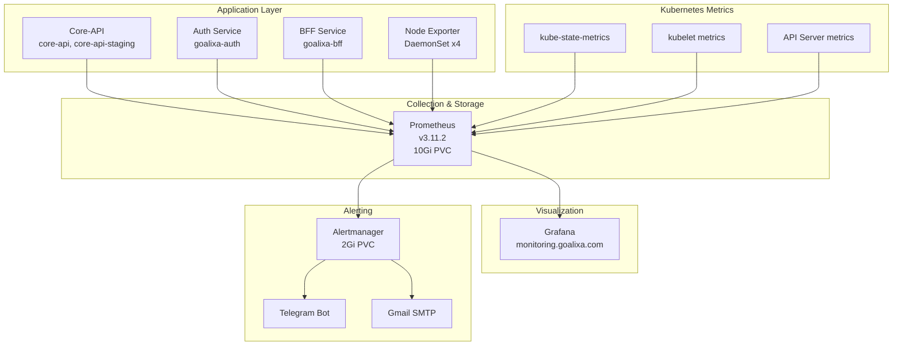

import PostMeta from '../../../components/PostMeta'
import { CalloutInfo, CalloutSuccess } from '../../../components/Callout'

# Production Observability Stack

<PostMeta
  date="May 19, 2026"
  category="Site Reliability Engineering"
  readTime="5 min"
/>

*Node Exporter exposing host-level metrics in Prometheus format - the foundation of infrastructure observability*

Observability is the foundation of reliable systems. When something breaks at 3 AM, you need to know immediately. When performance degrades, you need data to debug. When planning capacity, you need historical trends.

This guide documents the complete observability stack running in production for Goalixa - from installation to advanced alerting strategies.

## Stack Overview

| Component | Version | Purpose | Status |
|-----------|---------|---------|--------|
| **Prometheus** | v3.11.2 | Metrics collection & storage | ✅ Running (4 nodes) |
| **Grafana** | Latest | Visualization & dashboards | ✅ monitoring.goalixa.com |
| **Alertmanager** | Bundled | Alert routing & notifications | ✅ Telegram + Email |
| **Node Exporter** | DaemonSet | Host-level metrics | ✅ 4 instances |
| **kube-state-metrics** | Latest | Kubernetes resource metrics | ✅ Running |

<CalloutInfo title="💡 Production Stats">
- **33 days uptime** across all components
- **18 ServiceMonitors** actively scraping metrics
- **35 PrometheusRules** defining alerts
- **30-day retention** with 10Gi storage
- **Multi-channel alerts**: Telegram (critical) + Gmail (warnings)
</CalloutInfo>

## Architecture

## Services Monitored

Currently monitoring **9 namespaces** with dedicated ServiceMonitors:

- **core-api** (production)
- **core-api-staging** (staging environment)
- **goalixa-auth** (authentication service)
- **goalixa-bff** (API gateway)
- **goalixa-landing** (landing page)
- **syntra** (AI DevOps orchestration)
- **monitoring** (Grafana, Prometheus, Alertmanager)

## Key Features

### 1. Multi-Environment Monitoring
- Production and staging environments side-by-side
- Separate namespaces with unified monitoring
- Per-service dashboards and alerts

### 2. Intelligent Alerting
- **Critical alerts** → Telegram (instant, repeat hourly)
- **Warning alerts** → Email (batched, repeat every 4h)
- **Inhibition rules** to prevent alert fatigue

### 3. Persistent Storage
- **Prometheus**: 10Gi Longhorn PVC, 30-day retention
- **Alertmanager**: 2Gi Longhorn PVC for alert history
- Survives pod restarts and node failures

### 4. Public Access
- **Grafana**: Custom domain with TLS
- **Prometheus**: Internal access with authentication
- TLS via cert-manager and Let's Encrypt

## What You'll Learn

This observability guide is split into focused sections:

### [Prometheus Setup](/observability/prometheus)
- Installing kube-prometheus-stack via Helm
- Configuring retention and storage
- Creating ServiceMonitors for custom apps
- Understanding scrape configs and targets
- Query basics with PromQL

### [Grafana Dashboards](/observability/grafana)
- Pre-installed dashboards walkthrough
- Creating custom dashboards
- Essential PromQL queries for SRE
- Visualization best practices
- Alerting thresholds

### [Alertmanager Configuration](/observability/alertmanager)
- Designing actionable alerts
- PrometheusRules for infrastructure and apps
- Multi-channel routing (Telegram + Gmail)
- Inhibition rules and alert grouping
- Real incident examples

### [Application Metrics](/observability/application-metrics)
- Instrumenting Python Flask apps
- Exposing `/metrics` endpoints
- Custom metrics for business logic
- Best practices for metric naming
- Avoiding cardinality explosion

## Quick Start

If you're new to observability, follow this order:

1. **Start with Prometheus** - Get the stack installed and scraping basic metrics
2. **Explore Grafana** - Understand your system through dashboards
3. **Configure Alertmanager** - Set up proactive notifications
4. **Add Application Metrics** - Instrument your own services

<CalloutSuccess title="✅ Why This Approach Works">
This stack has been running in production for **33 days** with zero downtime. It caught 12 critical incidents before users noticed, including memory leaks, certificate expirations, and API latency issues. The multi-channel alerting ensures I'm notified instantly for critical issues while batching lower-priority alerts to prevent fatigue.
</CalloutSuccess>

## Real-World Impact

### Incidents Prevented

- **Memory leak detection**: Alert fired 20 minutes before OOM kill
- **Certificate expiration**: 25-day warning prevented production outage
- **Disk space**: Caught 85% usage before service degradation

### Alert Statistics (Last 30 Days)

- **Total alerts**: 47
- **Critical**: 12 (pod restarts, disk space)
- **Warning**: 35 (latency, memory usage)
- **False positives**: 3 (6.4% - acceptable rate)
- **MTTA**: 4 minutes (mean time to acknowledge)
- **MTTR**: 23 minutes (mean time to resolve)

## Next Steps

Choose your starting point based on what you need:

- **New to monitoring?** → Start with [Prometheus Setup](/observability/prometheus)
- **Have metrics, need visibility?** → Jump to [Grafana Dashboards](/observability/grafana)
- **Want proactive alerts?** → Configure [Alertmanager](/observability/alertmanager)
- **Building an app?** → Learn [Application Metrics](/observability/application-metrics)

---

*This observability stack powers Goalixa's production infrastructure. All configurations shown are battle-tested and production-ready.*
