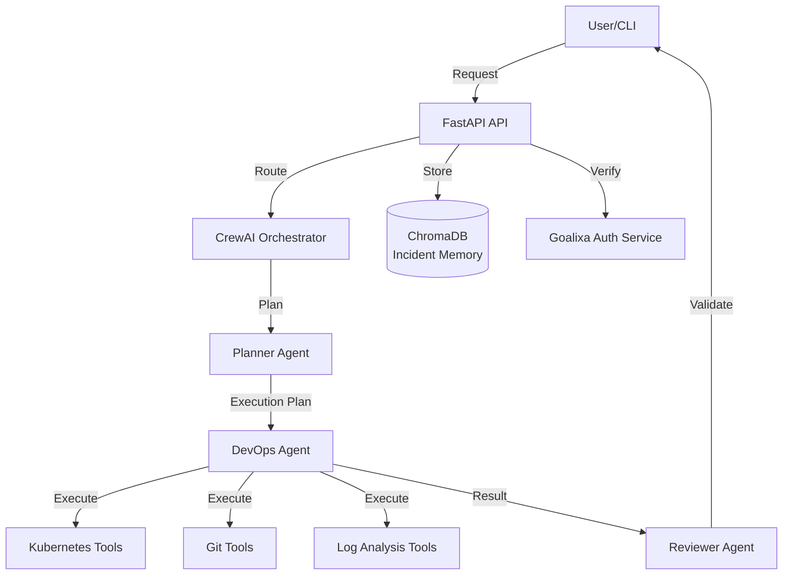
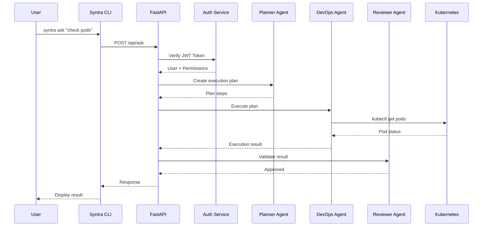
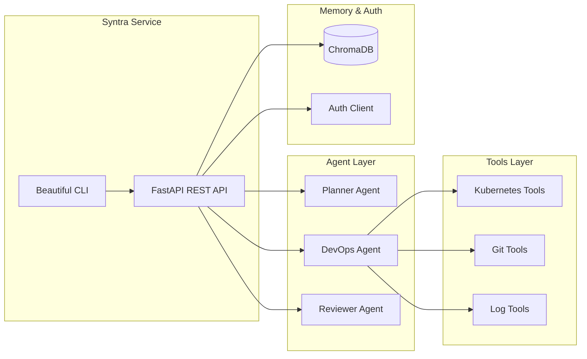
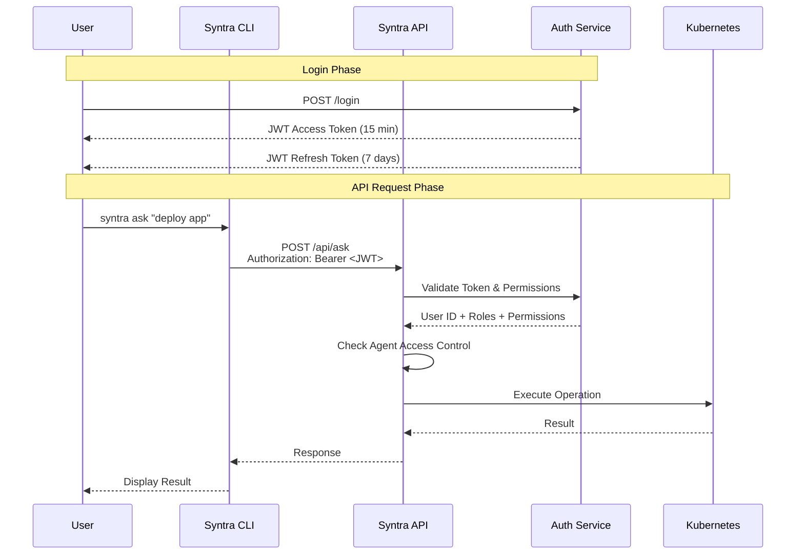

# Syntra: My AI DevOps Teammate

> **Published:** 2026-03-22 | **Section:** AI & Automation | **Author:** Amirreza Rezaie

## The Problem: Working Alone

While building Goalixa, I found myself constantly switching between tasks: deploying services, checking logs, debugging issues, reviewing changes, and managing infrastructure.

It felt like I needed a DevOps teammate — but I didn't have one.

So I built one.

## The Solution: Syntra

I designed and implemented an **AI-powered orchestration system** called **Syntra** that acts like a virtual teammate for handling DevOps and operational workflows.

Instead of manually executing tasks, I can now simply ask:

→ "Check pod status in production"
→ "Investigate auth service errors"
→ "Deploy the latest version of Core API"

And the system handles the rest.

## Architecture Overview

Syntra is built as a **multi-agent system** using **CrewAI** and **FastAPI**:

## User Traffic Flow

## Component Structure

## How It Works

### Multi-Agent System

Syntra uses three specialized agents, each with a specific role and permission level:

#### 1. **Planner Agent** (Role: Planning)
- **Responsibility**: Understands user requests and creates execution plans
- **Capabilities**:
  - Parse natural language requests
  - Break down complex tasks into steps
  - Identify required tools and permissions
  - Estimate resource requirements

#### 2. **DevOps Agent** (Role: Execution)
- **Responsibility**: Executes operational tasks on infrastructure
- **Capabilities**:
  - Interact with Kubernetes clusters
  - Execute Git operations
  - Analyze logs and metrics
  - Deploy and rollback services

#### 3. **Reviewer Agent** (Role: Validation)
- **Responsibility**: Validates results and prevents mistakes
- **Capabilities**:
  - Review execution results
  - Check for errors or anomalies
  - Validate against best practices
  - Maintain incident history

### Agent Roles and Limits

Each agent has specific roles and rate limits to ensure safe operation:

| Agent | Role | Rate Limit | Max Operations | Permissions |
|-------|------|------------|----------------|--------------|
| **Planner Agent** | `planner` | 60 req/min | 10 concurrent plans | Read-only |
| **DevOps Agent** | `devops` | 30 req/min | 5 concurrent ops | Read/Write (K8s, Git) |
| **Reviewer Agent** | `reviewer` | 60 req/min | 20 concurrent reviews | Read-only |

## Authentication & Authorization

### Goalixa Auth Service Integration

Syntra integrates with the **Goalixa Auth Service** for secure authentication and authorization.

#### Authentication Flow

#### JWT Token Structure

Syntra uses dual-token authentication system:

1. **Access Token** (15-minute TTL):
   - Used for API authentication
   - Contains user ID, roles, and permissions
   - Stored in memory (CLI)

2. **Refresh Token** (7-day TTL):
   - Used to obtain new access tokens
   - Stored securely (HTTP-only cookie in web)
   - Automatically rotates on refresh

#### Authorization Model

Each user request includes:
- **User ID**: Unique identifier
- **Roles**: `[admin, developer, viewer]`
- **Permissions**: `[kubernetes:read, kubernetes:write, git:read, git:write]`
- **Agent Limits**: Based on user role

**Permission Matrix:**

| Operation | Admin | Developer | Viewer |
|-----------|-------|-----------|--------|
| Plan tasks | ✅ | ✅ | ✅ |
| Execute K8s operations | ✅ | ⚠️ Limited | ❌ |
| Execute Git operations | ✅ | ⚠️ Limited | ❌ |
| View logs | ✅ | ✅ | ✅ |
| Deploy services | ✅ | ⚠️ Review required | ❌ |

### Agent Access Control

Each agent request validates:
1. **JWT Token validity**
2. **User permissions** for the requested operation
3. **Agent rate limits**
4. **Resource ownership** (namespace, repository)

## Key Features

### 1. Incident Memory
Uses **ChromaDB** (vector database) to store and retrieve past incidents:
- Learn from previous issues
- Suggest solutions based on history
- Maintain context across sessions

### 2. Beautiful CLI Interface
Built with **Typer** and **Rich**:
- Colored output and tables
- Interactive mode
- Progress indicators
- Health checks

### 3. REST API
FastAPI-based HTTP endpoints:
- `POST /api/ask` - Submit AI task
- `GET /health` - Health check
- `GET /metrics` - Prometheus metrics

## Why I Built This

I wanted to eliminate repetitive manual work and reduce context switching.

More importantly, I needed something that behaves like a teammate:

- **Understands intent** - Not just command execution
- **Plans tasks** - Breaks down complex requests
- **Executes operations** - Works with real infrastructure
- **Validates outcomes** - Reviews and prevents mistakes

## Tech Stack

- **Backend**: FastAPI, Python 3.11+
- **AI Orchestration**: CrewAI
- **Language Models**: LangChain (Claude)
- **Memory**: ChromaDB
- **CLI**: Typer + Rich
- **Infrastructure**: Kubernetes, Git

## Key Takeaway

**AI shouldn't just generate text — it should take action.**

Syntra is my step toward building autonomous systems that can operate, assist, and collaborate like real team members.

## What's Next

Current status: **Early Development / MVP**

### Implemented ✅
- Multi-agent framework
- FastAPI REST API
- Kubernetes tools (basic)
- Beautiful CLI
- Docker deployment

### In Progress 🚧
- Full LLM integration
- Auth service integration
- Complete tool implementations
- Incident memory with ChromaDB

### Planned 📋
- Multi-step task execution
- Agent collaboration patterns
- Advanced error recovery
- Metrics and monitoring

## Connect & Contribute

If you're building something similar or thinking about AI-driven automation, I'd love to connect.

**GitHub:** [https://github.com/goalixa/syntra](https://github.com/goalixa/syntra)

**The Goalixa Project:** [https://github.com/goalixa](https://github.com/goalixa)

---

**Tags:** `#ai` `#devops` `#orchestration` `#multi-agent` `#kubernetes` `#automation` `#crewai`
