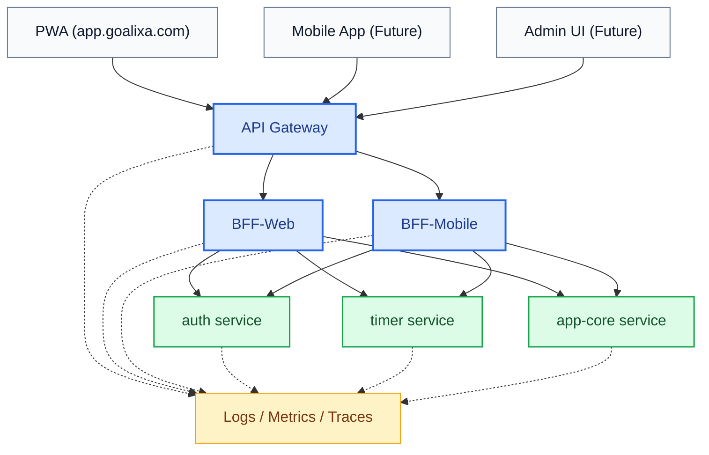
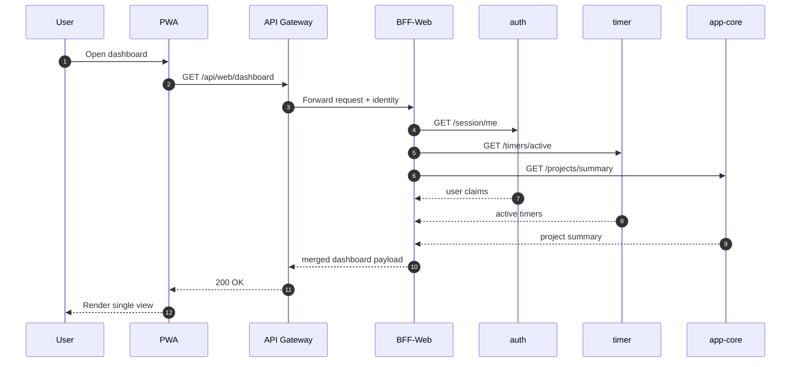

# BFF in Goalixa: The Layer That Brings Order Between PWA and Microservices (Draft)

Published: 2026-02-19  
Section: Architecture & Platform  
Status: Draft (Placeholder Data)

This is a draft version so the team can quickly fill it with production data later.  
The goal is to clarify the role of `BFF` next to `API Gateway` and turn the architecture direction into an executable plan.

## Quick summary

- `API Gateway` is the public API entry point (security, rate limit, routing, tracing).
- `BFF` is a client-specific adaptation layer that shapes responses for a specific UI (for example, PWA).
- For Goalixa: `PWA -> Gateway -> BFF-Web -> auth/timer/app-core`.

## API Gateway in our architecture



## What BFF solves

1. Fewer UI round-trips  
A single PWA page may need combined data from multiple services. BFF aggregates that.

2. Separation between client needs and domain services  
UI changes frequently, domain services should remain stable. BFF absorbs client-facing variation.

3. Response versioning per client  
`web v1` and `mobile v1` can receive different payloads without breaking core services.

4. Simpler frontend integration  
The PWA consumes task-oriented endpoints instead of many low-level service endpoints.

## API Gateway vs BFF

| Topic | API Gateway | BFF |
|---|---|---|
| Primary role | Public entry and global policies | Adaptation for one client type |
| Scope | All clients | One client (web/mobile/admin) |
| Business logic | Minimal | Light orchestration + view shaping |
| Security | Global authn/authz, rate-limit, WAF | Context-aware checks for client UX |
| Output style | Request pass-through/routing | UI-optimized payload |

## Example request flow in PWA



## Placeholder data for later completion

> The values below are sample-only and should be replaced with production data.

### KPI Snapshot (Sample)

| KPI | Before BFF | Target | Current Sample |
|---|---:|---:|---:|
| Dashboard API calls per load | 7 | 2 | 3 |
| p95 page data ready (ms) | 1450 | 850 | 920 |
| Auth-related frontend errors/day | 38 | < 10 | 12 |
| Avg payload size (KB) | 410 | 260 | 285 |
| Frontend integration points | 14 | 6 | 7 |

### Endpoint draft (Web BFF)

```http
GET  /api/web/dashboard
GET  /api/web/me
POST /api/web/timer/start
POST /api/web/timer/stop
GET  /api/web/projects/:id/overview
```

### Domain service calls (sample map)

```json
{
  "GET /api/web/dashboard": [
    "auth: GET /session/me",
    "timer: GET /v1/timers/active",
    "app-core: GET /v1/projects/summary"
  ],
  "POST /api/web/timer/start": [
    "auth: GET /session/me",
    "timer: POST /v1/timers/start"
  ]
}
```

## Suggested implementation rules

1. BFF should not replace core domain business rules from services.
2. BFF should not store sensitive state; keep it to orchestration and response shaping.
3. Version BFF response contracts (`/api/web/v1/...`).
4. Apply timeout/retry/circuit-breaker on inter-service calls.
5. Require full observability per BFF endpoint (trace + metric + structured logs).

## Draft completion checklist (TODO)

- [ ] Replace sample KPIs with real production values
- [ ] Add latency breakdown from APM
- [ ] Finalize the boundary of `Gateway` vs `BFF-Web`
- [ ] Add decision log for session/cookie strategy
- [ ] Document risks and rollback plan

## Draft summary

If Goalixa wants to move from "surface-level service split" to practical microservices, the `API Gateway + BFF` combination is a low-risk and scalable path.  
This draft intentionally includes starter data so the team can quickly evolve it into a final decision document.
