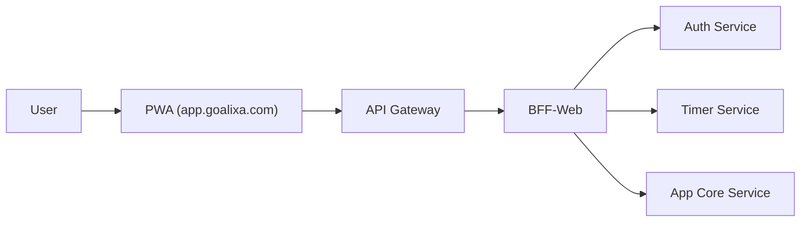
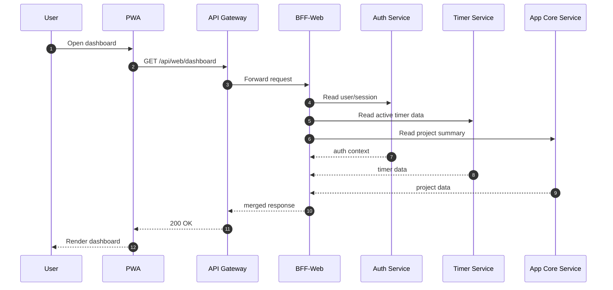

# BFF in Goalixa: How PWA and Services Stay Clean and Scalable

Published: 2026-02-20  
Section: Architecture & Platform

Goalixa uses a BFF (Backend For Frontend) to keep frontend flows simple while backend services stay focused on their own domain logic.

## Quick Summary

- `API Gateway` is the public entry point for API traffic.
- `BFF` shapes and aggregates data specifically for one client (web/PWA).
- Request model: `PWA -> Gateway -> BFF -> domain services`.

## Why BFF Matters

1. Fewer frontend API calls  
The BFF can merge multiple service responses into one payload for the UI.

2. Cleaner service boundaries  
Core services keep domain logic and avoid UI-specific response shaping.

3. Faster frontend iteration  
UI changes can be handled in the BFF layer without repeatedly changing every core service contract.

## Gateway and BFF in One View

## Example Request Flow

## Practical Rules

- Keep business rules in core services.
- Keep BFF focused on orchestration and response shaping.
- Version BFF endpoints for safer frontend evolution.
- Apply timeout and retry boundaries for service calls.

## Final Note

BFF is not extra complexity for Goalixa. It is the layer that keeps the product experience clean while service ownership stays clear and scalable.
