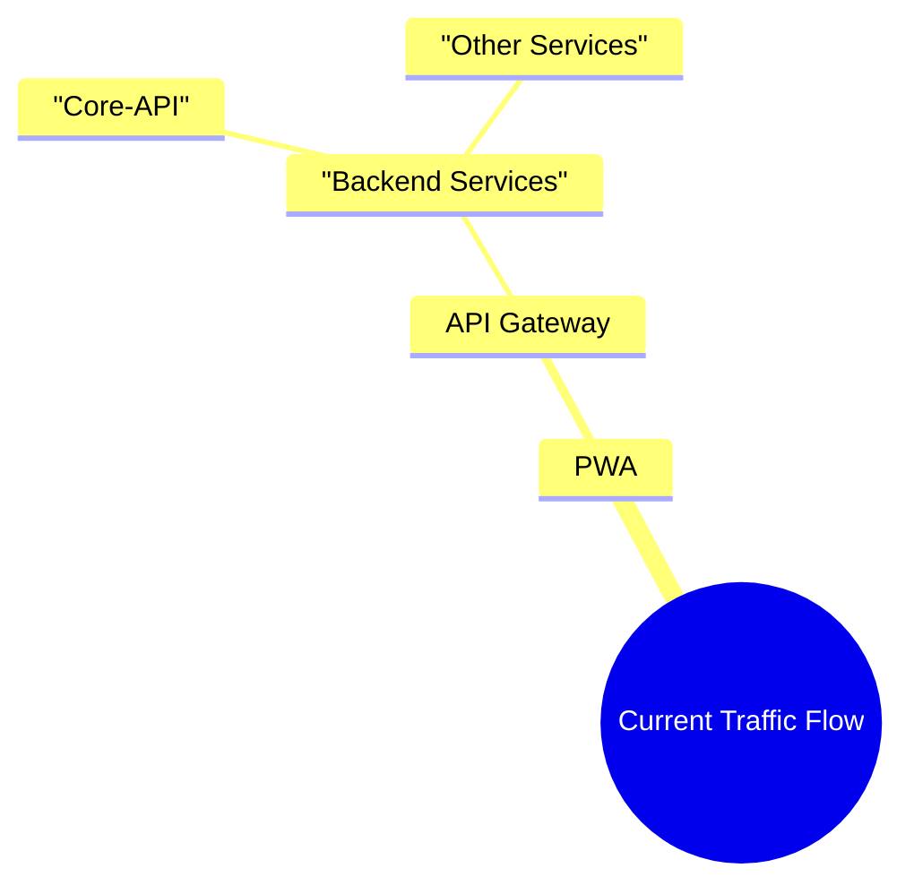

# Migrate to PWA Success fully

> **Published:** 2026-02-20 | **Section:** Architecture & Platform | **Author:** Amirreza Rezaie

Today I migrated to PWA and API Gateway successfully.

This is one of the biggest milestones for Goalixa, and I am really happy with the result.

## What Is Done

- PWA is now the main frontend entrypoint
- API Gateway is now the main API entrypoint
- Backend traffic is routed through the gateway layer
- Core product flow is now cleaner than before

## Current Traffic Flow

## Why This Change Is Important

Before this, flow between services was harder to manage because frontend pieces were spread across multiple services.

Now with PWA + API Gateway:

- I can move faster in backend development
- I can extract components and create new microservices easier
- Service boundaries are much clearer
- Future scaling decisions are more flexible

## Next Step After This Migration

Now I am ready to:

- Remove frontend codes from Core-API and Auth
- Keep backend services focused on backend responsibility only
- Start designing and adding new backend components as separate microservices

## GitOps Status

I am also happy because my GitOps tools are working fine:

- ArgoCD syncs applications correctly
- Harbor stores images in repository as expected

This gives me confidence to continue the migration with safer releases.

## Personal Note

Building API Gateway was an amazing experience for me.

At this stage, I feel much more flexible in architecture decisions and much more ready to grow Goalixa with a real microservice mindset.
