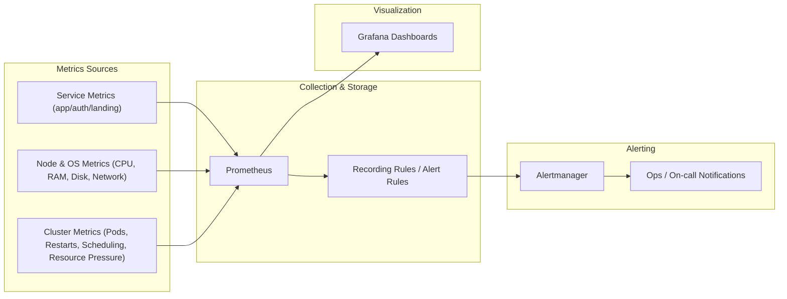

# Monitoring Stack Setup: Prometheus, Grafana, and Alertmanager

> **Published:** 2026-02-20 | **Section:** Reliability & Operations

I set up a monitoring stack to observe Goalixa at three levels:

- Service level
- OS/node level
- Cluster level

The core stack is:

- Prometheus for metrics collection and storage
- Grafana for dashboards and visualization
- Alertmanager for alert routing and notifications

## Monitoring Goals

- Expose metrics from each service
- Track health and performance for nodes and cluster
- Detect failures faster with useful alerts
- Reduce incident response time

## Monitoring Flow

## Alerting Strategy

I want to configure useful alerts for each service and node, such as:

- Service down / high error rate
- High latency on critical endpoints
- Pod restart spikes
- Node CPU/memory/disk pressure
- Cluster resource saturation

## Next Improvement Steps

1. Finalize per-service SLI/SLO-aligned alerts
2. Tune alert thresholds to reduce noise
3. Add dashboard views for incident triage
4. Define severity levels and escalation policy
