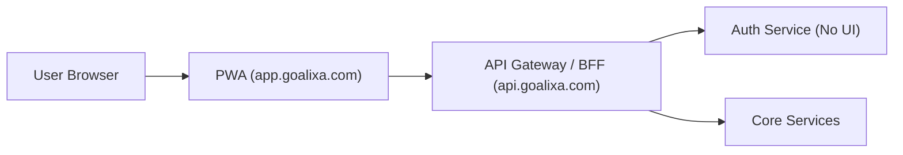
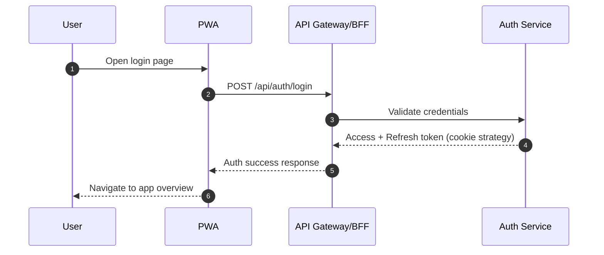

# Removing UI from Legacy Services: Rebuilding Auth Redirect and Token Flow

> **Published:** 2026-02-23 | **Section:** Architecture & Platform | **Author:** Amirreza Rezaie

I am currently removing UI from legacy services and moving all frontend responsibility to the PWA.

This migration exposed a real issue in my auth flow: access/refresh token behavior is unstable, users are logged out too early, and redirect behavior between `PWA`, `BFF`, and `Auth` is not reliable enough.

I built the first version fast for production with AI support, without deeply understanding all auth details at that time.  
Now I want to redesign it correctly and implement it with full ownership.

## Current Problems

- Token lifetime does not match expected behavior.
- Users are logged out after a short time (around 7 minutes in many cases).
- Redirect flow is hard to reason about across `app.goalixa.com`, `api.goalixa.com` (BFF/Gateway), and `auth` service.
- Auth logic is mixed with legacy assumptions from multi-UI architecture.

## Target Direction

- One frontend: `app.goalixa.com` (PWA only)
- No UI inside backend services (`auth`, `timer`, `app-core`, ...)
- One API entry point through gateway/BFF
- Auth service remains backend-only and focused on identity/session/token management

## Redirect Model I Need

The PWA should own navigation and pages.  
Auth service should not render login/signup/reset pages.

High-level flow:

1. User opens `/login` in PWA
2. PWA starts auth request via BFF
3. BFF talks to auth service
4. Auth service issues cookies/tokens
5. Browser is redirected back to PWA route with a clean state

## Token Flow I Need to Stabilize

- Short-lived access token (for API authorization)
- Longer-lived refresh token (for silent renewal)
- Rotation and revocation rules must be explicit
- Cookie attributes must match real deployment (`HttpOnly`, `Secure`, `SameSite`, `Domain`, `Path`)

If these details are inconsistent, users will be logged out unexpectedly even when backend logic looks correct.

## Implementation Focus

1. Remove legacy UI assumptions from auth service completely  
2. Define redirect contract between PWA and BFF  
3. Define strict token/refresh contract with clear TTL and rotation behavior  
4. Add observability for auth lifecycle events (login, refresh success/fail, logout, token revoke)  
5. Test in local + staging with real subdomain/cookie behavior

## Final Note

This is not just refactoring.  
For me, this is moving from "it works in production for now" to "I fully understand and own my auth architecture."
