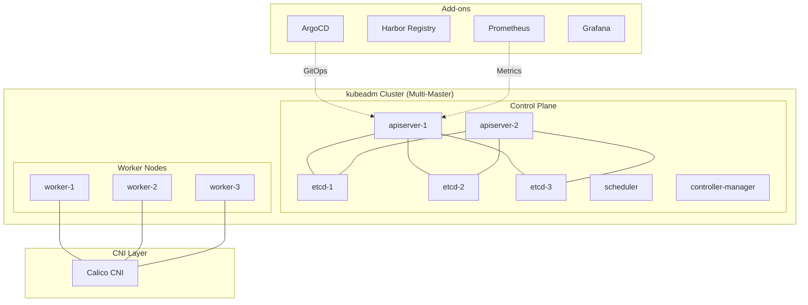

# From k3s to kubeadm: My Kubernetes Migration Journey

> **Published:** 2026-04-15 | **Section:** Site Reliability Engineering | **Author:** Amirreza Rezaie

Every infrastructure decision is a trade-off. When I started building Goalixa, I chose k3s because it let me move fast. Fast forward to today, and I'm planning a migration to a kubeadm-based cluster. This post documents why I'm making the switch, what I'm learning along the way, and the practical strategy I'm using to get there.

## Introduction: Why I Built Goalixa

Goalixa wasn't born from a desire to run Kubernetes at all costs. It started as a simple question: *Can I build a production-grade productivity app while demonstrating real DevOps and SRE skills?*

I wanted to prove that a small team — or even a single engineer — can operate like a mature tech company. That means:

- GitOps-driven deployments
- Observability stack with Prometheus and Grafana
- Chaos engineering with LitmusChaos
- Real Kubernetes orchestration, not just "kubectl apply"

But here's the thing about learning in public: your early decisions reflect your early knowledge. And my knowledge about Kubernetes clusters was... limited. I knew enough to spin up k3s, but not enough to debug why the scheduler was behaving strangely at 2 AM.

That changes now.

## Current Architecture: k3s-Based Setup

My current k3s cluster runs on a single node (well, technically three VMs, but single-plane) with everything co-located:

```mermaid
graph TD
    subgraph "k3s Cluster (Single Node)"
        subgraph "Control Plane"
            API[k3s API Server]
            ETCD[etcd (embedded)]
            SCHED[k3s Scheduler]
            CM[k3s Controller Manager]
            KPROXY[k3skube-proxy]
            CNI[CNI Plugin]
        end

        subgraph "Workloads"
            CORE[Core API]
            AUTH[Auth Service]
            BFF[BFF Gateway]
            LAND[Landing Page]
        end

        subgraph "Add-ons"
            ARGO[ArgoCD]
            HARBOR[Harbor Registry]
            PROM[Prometheus]
            GRAF[Grafana]
            LITMUS[LitmusChaos]
        end
    end

    USER[User Traffic] --> BFF
    BFF --> CORE
    BFF --> AUTH
    BFF --> LAND
```

Everything runs on infrastructure I canSSH into. The control plane components are managed by k3s, the CNI is bundled, and etcd is embedded. ArgoCD watches my GitHub repo and syncs applications. Harbor holds my container images. Prometheus scrapes metrics from every pod.

For a learning project, this was *perfect*. I could focus on application architecture instead of fighting YAML.

## Why k3s Was the Right Choice Initially

Let me be clear: k3s wasn't a mistake. It was the right tool for where I was.

### Advantages that made k3s perfect for Goalixa:

- **Fast setup**: `curl -sfL https://get.k3s.io | sh` and done. Five minutes from bare metal to running cluster.
- **Lightweight**: Binary under 100MB. Runs on a VM with 2GB RAM without sweating.
- **Batteries included**: Built-in service mesh (K3s), local path provisioner, Helm controller. No extra installations.
- **Single-node friendly**: Doesn't require three control plane nodes to start learning.
- **Production-ready defaults**: TLS, RBAC, network policies all configured.

I deployed my first workload in a weekend. That speed mattered. If I'd spent two weeks building a kubeadm cluster, I might have given up before writing any code.

The trade-off was acceptable *because* I was building an MVP, not a product people depended on.

## The Problem: What k3s Hid From Me

But here's where k3s became a liability. As Goalixa grew, so did my questions:

- Why is my pod stuck in `Pending`? → "Check the scheduler logs" → *Where are the scheduler logs?*
- etcd is slow → *Where is etcd running? How do I compact it?*
- API server is failing → *How do I debug apiserver flags without restarting?*

The answer to all of these was: **You can't easily**. k3s abstracts the control plane into a black box:

### What k3s hides:

1. **etcd**: Embedded, managed, no direct access. I can't run `etcdctl` or tune `--auto-compaction`. I can't snapshot the datastore without knowing k3s-specific paths.

2. **Control plane components**: apiserver, scheduler, controller-manager run as pods managed by k3s. No systemd units. No individual process management. Harder to debug with standard tools.

3. **CNI**: Uses a bundled CNI (usually Flannel or Traefik). Swapping to Calico or Cilium requires fighting the bundled install.

4. **Upgrade path**: `k3s upgrade` works, but upgradePath management across versions is less transparent than kubeadm's documented process.

5. **Multi-master**: k3s supports high availability, but it's designed for simplicity. Production multi-master with external etcd is possible but not the default experience.

For a DevOps engineer who wants to *understand* Kubernetes deeply, these limitations matter. I can deploy a pod, write a Service, and configure Ingress. But when something breaks at the cluster level, I need to be able to debug like a cluster admin — not a user who happens to have kubectl installed.

## The Decision: Moving to kubeadm

I'm not moving to EKS, GKE, or AKS. Those are excellent choices for running workloads, but they hide even more. I'm moving to **kubeadm** — the upstream tool for building "real" Kubernetes clusters.

### Why kubeadm:

- **Full control plane visibility**: etcd, api-server, scheduler, controller-manager as systemd services you can examine, restart, and debug.
- **Standard tooling**: Use `kubectl`, `crictl`, `etcdctl`, `coredns` exactly as upstream expects.
- **Multi-master ready**: Explicit control plane bootstrap with clear etcd membership.
- **CNI flexibility**: Install any CNI plugin. Calico, Cilium, Weave — your choice.
- **Certification-aligned**: If you're studying for CKA, kubeadm experience maps directly to exam scenarios.

### What I want to learn from this:

- etcd operations: snapshots, restores, member management
- Control plane debugging: reading apiserver logs, tuning scheduler, understanding controller loops
- Networking deep dives: pod networking, CNI, service mesh integration
- Production-grade operations: backup strategies, upgrade procedures, rolling updates

This migration is an investment in my SRE skills. Every hour spent debugging etcd is an hour that makes me better at incident response.

## Migration Strategy: k3s to kubeadm

Here's where it gets practical. You don't "migrate" a Kubernetes cluster — you rebuild with the same manifests. Here's my step-by-step:

### Phase 1: Build the new cluster, keep the old running

I won't touch my existing k3s cluster until the new cluster is healthy.

```bash
# Step 1: Initialize kubeadm control plane
sudo kubeadm init --pod-network-cidr=192.168.0.0/16 --service-cidr=10.96.0.0/12

# Step 2: Save the join command
kubeadm token create --print-join-command

# Step 3: Install CNI (Calico example)
kubectl apply -f https://docs.projectcalico.org/manifests/calico.yaml

# Step 4: Verify control plane
kubectl get pods -n kube-system
kubectl get nodes
```

The key insight: **I keep workloads running on k3s until the new cluster can accept traffic.**

### Phase 2: Expand the new cluster

Once the control plane is healthy, add worker nodes:

```bash
# From each new worker node
sudo kubeadm join <control-plane-ip>:6443 --token <token> \
    --discovery-token-ca-cert-hash sha256:<hash>
```

My current k3s will become a worker node or be decommissioned entirely, depending on resource availability.

### Phase 3: Migrate workloads

Here's the critical part: **We don't move pods. We move manifests.**

```bash
# Export from k3s
kubectl get all,configmap,secret,ingress -A -o yaml > k3s-resources.yaml

# Edit the YAML:
# - Change namespace if needed
# - Verify storageClass references
# - Update ingress class names

# Apply to new cluster
kubectl apply -f cleaned-resources.yaml
```

Why clean YAML? Because:
- k3s may use different storage classes (`local-path` vs `standard`)
- Ingress class annotations differ
- Some resources reference k3s-specific configmaps

After applying, verify:
```bash
kubectl get pods -A
kubectl get svc -A
kubectl get ingress -A
```

### Phase 4: Switch traffic

Update DNS or load balancer to point to the new cluster's ingress. Monitor error rates. Have a rollback plan (point DNS back to k3s if things go wrong).

### Phase 5: Decommission k3s

Only after I'm confident the new cluster is stable:
```bash
# On k3s node
k3s-uninstall.sh
# Or just shut down the VM
```

## Challenges I Expect

Every migration has gotchas. Here's what I'm preparing for:

### 1. Stateful workloads

- PostgreSQL pods with PersistentVolumeClaims
- The local-path provisioner on k3s won't exist on kubeadm
- Need to either: provision real PVs (Longhorn, Ceph), or export/import data

### 2. Networking differences

- k3s uses its own CNI by default; kubeadm leaves it to me
- Calico policies won't import 1:1 from Flannel
- Service cluster IPs may change

### 3. Ingress differences

- k3s bundles Traefik; I may choose nginx-ingress or Ambassador
- IngressClass resources need recreation
- TLS certificates may differ

### 4. Observability continuity

- Prometheus rules, Grafana dashboards, alert configurations need exporting
- Historical data won't transfer (acceptable for a learning project)

The key principle: **migrate manifests, not state**.

## Target Architecture: kubeadm-Based Setup

After migration, the cluster looks different:



Now I can:
- Debug etcd directly with `etcdctl`
- Restart individual control plane components via systemd
- Choose my CNI based on requirements, not defaults
- Scale apiserver horizontally (at least conceptually on my three VMs)

## Why This Matters for SRE

Here's the honest truth: I could run Goalixa on k3s forever. It's stable, it works, and nobody is paying me to maintain it.

But I'm not building Goalixa to run a product. I'm building it to **learn SRE skills at depth**.

### What this migration teaches:

1. **Failure injection**: How does the cluster behave when etcd loses a member? I'll find out by breaking things deliberately.

2. **Control plane debugging**: When API server latency spikes, I'll know where to look — not just "check kubectl get events".

3. **Observability at cluster level**: Node-level metrics, control plane metrics, etcd health. Not just "is the pod running?".

4. **Disaster recovery**: If the cluster dies, I want to be able to reconstruct it — from scratch, using documentation I wrote.

5. **Incident response**: Real cluster means real incidents. This time, when something breaks, I debug it like an SRE.

This is the difference between "using Kubernetes" and "operating Kubernetes". One makes you feel like a developer. The other makes you feel like an engineer.

## Conclusion: Continuous Experimentation

Goalixa started as a portfolio project. It's becoming a platform for continuous experimentation.

The k3s to kubeadm migration isn't about upgrading for upgrade's sake. It's about intentionally choosing a harder path because the difficulty teaches something valuable.

If you're building a project to learn DevOps or SRE, start with k3s. It's perfect for that phase. But when you're ready to understand the cluster itself — not just what's running on it — kubeadm gives you the transparency you need.

I'll document what breaks, what I learned, and what I'd do differently. That's the point of learning in public.

---

**Related Posts:**

- [Monitoring Stack Setup: Prometheus, Grafana, and Alertmanager](/posts/monitoring-stack-prometheus-grafana-alertmanager.md) — Observability before the migration
- [GitOps with ArgoCD: First Steps](/posts/gitops/argocd-first-step.md) — How I manage cluster state
- [Incident Report: PWA Path Change Caused High Latency](/posts/incident-reports/pwa-path-latency-incident.md) — Debugging in production

**Tags:** #kubernetes #k3s #kubeadm #devops #sre #migration